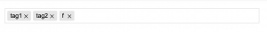

最近在製作公司的小工具的時候，要做到『貼標籤』的功能，找了幾款可以用的套件，用一用覺得 Tagify 最喜歡，所以紀錄一下！

<!--more-->

GitHub: [https://yaireo.github.io/tagify/](https://yaireo.github.io/tagify/)

Tagify 是一個前端組件，主要用在前後端分離的應用，也有基於 jQuery 的實現。

首先在頁面內引入 jQuery.tagify.min.js 文件

```html
<script src="https://github.com/yairEO/tagify/blob/master/dist/jQuery.tagify.min.js"></script>
```

接著要用一個 HTML <input> Tag 讓使用者可以輸入和看到標籤

```html
<input name='basic' value='tag1, tag2'>
```

然後寫點 JavaScript

```js
// 您希望 Tagify 替換的 DOM 元素
var input = document.querySelector('input[name=basic]');

// 在 input 初始化 Tagify
new Tagify(input)
```

如此一來就完成一個很精美好用的『貼標籤』，至於後端要怎麼去儲存，又是另一個事情了。


