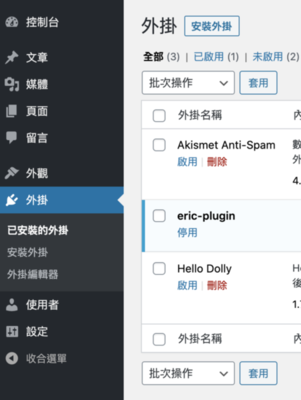
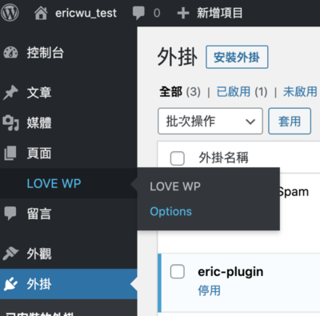

好了，我們現在會新增一個外掛，也會對外掛做點事情了，但是總覺得還是少點什麼，是不是可以更好？

對了，就是少了一個管理選單！管理選單是 WordPress 後台左側顯示的後台管理功能選單，可以讓我們為外掛或是主題客製化一個設置選項頁面，像是這樣


選單在 WordPress 後台的左側顯示，可以在裡面塞進子選單。

## 第一層選單

接著，我們來看看如何添加一個選單到我們的 WordPress 後台。我們可以使用 [add\_menu\_page()](https://developer.wordpress.org/reference/functions/add_menu_page/) 函式來做新增。

```php
<?php
add_menu_page(
    string $page_title,
    string $menu_title,
    string $capability,
    string $menu_slug, 
    callable $function = '',
    string $icon_url = '',
    int $position = null
);
```

看起來一堆參數，好像很複雜。我們馬上來試試看，假設我們今天想新增一個 `LOVE_WP` 的選單。

第一步，我們需要有一個函式來輸出我們選單頁面的 HTML :

```php
<?php
function love_wp_options_page_html() {
   // 先確認 user 是否有權限使用選單
   if (!current_user_can('manage_options')) {
      return;
   }
   ?>
   // 下面開始寫一些你想呈現的 HTML
    ...
   <?php
}
```

第二步，把剛剛的函式放到 `admin_menu` action hook 上面。

```
<?php
function love_wp_options_page() {
   add_menu_page(
      'LOVE WP', // 頁面標題
      'LOVE WP', // 選項標題
      'manage_options', //這個選單給用戶的功能
      'love_wp', // 選單的 slug 名稱（必須唯一）
      'love_wp_options_page_html', // 要輸出此頁面內容的函式
      plugin_dir_url(__FILE__) . 'images/icon_test.png', // 這個選單的的 icon 的URL
      20 // 選單顯示的順序位置
   );
}
add_action('admin_menu', 'love_wp_options_page');
```

這樣我們就可以為我們的第一個外掛，建立第一個選單了！


### 使用 PHP 創建 HTML

為了讓我們的程式碼提高可移植性，所以最佳實踐會是創建一個包含 callback function 的文件。網路上建議把一個文件路徑作為 `$menu_slug` 參數傳遞給 `$function` 參數，用這種方法註冊選單：

```php
<?php
function love_wp_options_page()
{
   add_menu_page(
      'LOVE WP',
      'LOVE WP',
      'manage_options',
      plugin_dir_path(__FILE__) . 'admin/view.php', // 把 view 提取出來
      null,
      plugin_dir_url(__FILE__) . 'images/icon_test.png',
      20
   );
}
add_action('admin_menu', 'love_wp_options_page');
```

### 刪除頂級菜單

我們也可以刪除後台中已經註冊好的選單，使用 [remove\_menu\_page()](https://developer.wordpress.org/reference/functions/remove_menu_page/) 函式。

```php
remove_menu_page(
    string $menu_slug
);
```

例如說，我今天想要從 WordPress 後台刪除 `工具` 這個選單。這裡我們的優先權設定為 99 ，是因為在刪除之前，我們需要確保已經註冊了這個選單。所以，刪除的優先級應該要比註冊的低。

```php
<?php
function want_to_remove_options_page(){
   remove_menu_page('tools.php');
}
add_action('admin_menu', 'want_to_remove_options_page', 99);
```

我們的`工具`就被移除囉！



## 子選單

如果我們需要添加一個子選單到 WordPress 後台，跟剛剛的選單新增方式很像，但是，這次是使用 [add\_submenu\_page()](https://developer.wordpress.org/reference/functions/add_submenu_page/) 函式。

```php
<?php
add_submenu_page(
   string $parent_slug,
    string $page_title,
    string $menu_title,
    string $capability,
    string $menu_slug,
    callable $function = ''
);
```

假設，我們今天想在剛剛的選單中，添加一個子選單

第一步，我們一樣也要有個函式來輸出我們的 HTML。

```
<?php
function love_wp_sub_options_page_html() {
   // check user capabilities
   if (!current_user_can('manage_options')) {
      return;
   }
   ?>
    //也是寫一堆 HTML
    ....
   <?php
}
```

第二步，把上面的函式放到 admin\_menu Action hook 上

```php
<?php
function love_wp_sub_options_page() {
   add_submenu_page(
      'love_wp', // 第一層選單的 slug
      'Options',
      'Options',
      'manage_options',
      'love_wp_option',
      'love_wp_sub_options_page_html'
   );
}
add_action('admin_menu', 'love_wp_sub_options_page');
```

太好了，我們這樣就有選單和子選單了



### 刪除子菜單

刪除子選單的方法和刪除第一層選單是一樣的。

### 輔助函數

順帶一提， WordPress 提供了了許多好用的輔助函式，我們只需要設置好了 `$parent_slug` 參數，就可以使用相應的函式，快速的新增頁面到我們的第一層選單。以下是 WordPress 為我們定義好的輔助函式。

[add\_dashboard\_page()](https://developer.wordpress.org/reference/functions/add_dashboard_page/) –index.php [add\_posts\_page()](https://developer.wordpress.org/reference/functions/add_posts_page/) –edit.php [add\_media\_page()](https://developer.wordpress.org/reference/functions/add_media_page/) –upload.php [add\_pages\_page()](https://developer.wordpress.org/reference/functions/add_pages_page/) –edit.php?post\_type=page [add\_comments\_page()](https://developer.wordpress.org/reference/functions/add_comments_page/) –edit-comments.php [add\_theme\_page()](https://developer.wordpress.org/reference/functions/add_theme_page/) –themes.php [add\_plugins\_page()](https://developer.wordpress.org/reference/functions/add_plugins_page/) –plugins.php [add\_users\_page()](https://developer.wordpress.org/reference/functions/add_users_page/) –users.php [add\_management\_page()](https://developer.wordpress.org/reference/functions/add_management_page/) –tools.php [add\_options\_page()](https://developer.wordpress.org/reference/functions/add_options_page/) –options-general.php [add\_options\_page()](https://developer.wordpress.org/reference/functions/add_options_page/) –settings.php
