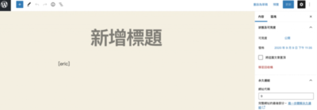
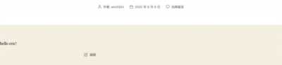
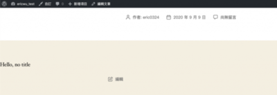
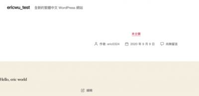

為了安全，在 WordPress 的世界中，是禁止在內容中運行 PHP 程式碼的，不過有時候我們還是希望說可以動態新增一些內容，所以在 WordPress 2.5 版中引入了 shortcode。

shortcode 是用讓我們在不插入 PHP 程式碼的情況下，動態新增內容的一段 code，對文章動態的新增相簿、播放影片、加入表單，或者實現更多自定義的功能。

WordPress 本身就內建了以下幾個 shortcode：

- caption – 為圖片或影片添加說明
- gallery – 顯示相簿
- audio – 嵌入和播放音樂
- video – 嵌入和播放影片
- playlist – 顯示影音文件
- embed – 顯示嵌入式內容

如果有在 WordPress 寫一陣子文章的話，應該常常用到，所以我就不贅述了。

## 基本 shortcode

### 新增一個 shortcode

我們可以使用 WordPress 提供的 shortcode API 來添加 shortcode，整個過程很簡單，使用 [add\_shortcode()](https://developer.wordpress.org/reference/functions/add_shortcode/) 函式來註冊就可以了。

```PHP
<?php
add_shortcode(
   string $tag,
    callable $func
);
```

這邊示範一下怎麼註冊 shrotcode

```PHP
<?php
function eric_shortcode($atts = [], $content = null) {
   // do something to $content
   $content = 'Hello Eric!';
   // always return
   return $content;
}
add_shortcode('eric', 'eric_shortcode');
```

eric 是我們註冊的 shortcode，我們現在可以使用這個 shortcode



會調用 eric\_shortcode 函式回傳的東西來顯示內容。 

### 在外掛中註冊 shortcode

和在主題中註冊 shortcode 不一樣，外掛在 WordPress 的執行過程中，時間點非常早！！因此，我們需要延遲添加 shortcode 的操作到 WordPress 初始化完成之後。網路上是建議使用 init action 來實現。

```PHP
<?php
function eric_shortcodes_init() {
   function eric_shortcode($atts = [], $content = null) {
      // do something to $content
      $content = 'Hello Eric!';
      // always return
      return $content;
   }
   add_shortcode('eric', 'eric_shortcode');
}
add_action('init', 'eric_shortcodes_init');
```

### 刪除 shortcode

當我們不再需要一個 shortcode 時，也可以使用 [remove\_shortcode()](https://developer.wordpress.org/reference/functions/remove_shortcode/) 來刪除他。

```PHP
<?php
remove_shortcode(
   string $tag
);
```

### 檢查 shortcode 是否存在

如果需要檢查 shortcode 是否已被註冊，我們可以使用 [shortcode\_exists()](https://developer.wordpress.org/reference/functions/shortcode_exists/) 函式來檢查。

## Enclose Shortcode

WordPress 中有兩種形式的 shortcode：

1. 開合 Shortcode: 類似於 HTML 中 br, img 這種不需要左右包起來的標籤。
2. 自關閉 Shortcode: 類似於 HTML 中的 div, p 這種需要左右包起來的標籤。

### 如何解析

拿剛剛一開始寫的那段 `eric_shortcode` 函式來看

```
<?php
function eric_shortcode($atts = [], $content = null) {
   // do something to $content
   $content = 'Hello Eric!';
   // always return
   return $content;
}
add_shortcode('eric', 'eric_shortcode');
```

我們可以看到，我們定義的函式接受兩個參數，分別是 `$atts` 和 `$content`，其中就是這個 `$content` ，他預設值為 `null`，我們可以使用 PHP 函式 `is_null()` 來區他是哪種標籤。

舉例來說，剛剛自己定義了 shortcode 是 \[eric\]、其中包含的內容和結束標記 \[/eric\] 會被 shortcode 的callback function 的回傳值替換。

## Shortcode 可以餵參數嗎？

可以，在這之前我們先看看餵參數是怎樣的餵法

```
[eric title=happy] Having fun with shortcodes. [/eric]
```

所以要怎麼達成這件事情呢？我們來寫一段簡單的程式碼：

```PHP
<?php
function eric_shortcode($atts = [], $content = null){
    $atts = shortcode_atts(
        array(
            'title' => 'no title'
        ), $atts, 'eric' );

    return "Hello, ".$atts['title'];
}
add_shortcode('eric', 'eric_shortcode');
```

我們看看剛剛寫的 `eric_shortcode` 這個函式。 我會先用 `shortcode_atts()` 來指定預設的參數值，萬一在 shortcode 中沒有帶入參數的話的時候會使用預設值 `Hello World`。然後我們會回傳 `"Hello, ".$atts['title']`，這樣我們今天有參數就會用參數，沒參數也會用預設值。

沒有參數的時候：



有參數的時候： 

## Shortcode 的一些限制

Shortcode 解析器會不能處理把 開合 Shortcode 包在 自關閉 Shortcode，舉例：

```
[wporg] non-enclosed content [wporg] enclosed content[/wporg]
```

解析器在解析內容的時候，會把上面 Shortcode 中的 `non-enclosed content [wporg]enclosed content` 視為單個 shortcode 來看，而不是作為被 `non-enclosed content` 分隔的兩個 shortcode ，這邊可能要注意一下！
