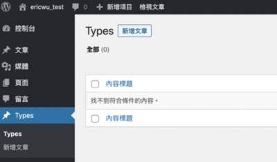

我們有時候會想自己定義的文章的類型，所以接著，我們就來看看如何註冊自定義文章類型，以及如何從資料庫中取得自定義文章類型內容並且把這些內容顯示給使用者。

## 自定義文章類型

WordPress 預設有五種文章類型，分別是 post, page, attachment, revision 和 menu。我們有時候，可能需要創建自定義文章類型，比如說：購物網站的商品、遊戲網站的遊戲。

### 註冊自定義文章類型

因此，我們可以使用 [register\_post\_type()](https://developer.wordpress.org/reference/functions/register_post_type/) 函式來註冊一個自定義的文章類型。註冊之後，WordPress 會自動幫我們添加一個新文章類型菜單到 wp\_psots 資料表中，我們就可以通過這個分類來創建文章。下面做個簡單的示範：

```php
function eric_custom_post_type() {
   register_post_type( 'eric_type',
      [
         'labels'      => [
            'name'          => __( 'Types' ),
            'singular_name' => __( 'Type' ),
         ],
         'public'      => true,
         'has_archive' => true,
      ]
   );
}

add_action( 'init', 'eric_custom_post_type' );
```

我們多了一個新的文章類型了！ 

### 網址

如果我們需要為自定義文章類型設置一個別名，可以在 register\_post\_type() 的 rewrite 參數中添加一個 key value ，如下：

```php
function eric_custom_post_type() {
   register_post_type( 'eric_type',
      [
         'labels'      => [
            'name'          => __( 'Types' ),
            'singular_name' => __( 'Type' ),
         ],
         'public'      => true,
         'has_archive' => true,
         'rewrite'     => [ 'slug' => 'types' ], // my custom slug
      ]
   );
}

add_action( 'init', 'eric_custom_post_type' );
```

如此一來，我們就可以為我們的自定義文章類型設置一個別名囉！
