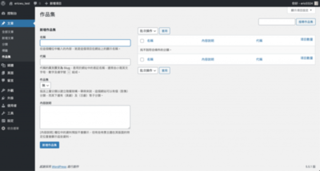

在 WordPress 的世界中，我們可以註冊自定義分類法，分類的方法會被存儲在 `term_taxonomy` 資料表中。分類方法中有一些分類項目，這些項目則會被存儲在 `wp_terms` 資料表中。什麼意思呢？我們舉個例，名為 `程式設計` 的分類方法底下會有多個分類項目，例如說：`PHP` 和 `Python` ，大概就是這種關係。

所以接著，我們會來學習怎麼註冊一個自定義的分類方法，以及如何從我們的資料庫中去取得自定義的分類方法內容，然後顯示給用戶。

## 使用自定義分類法

### 自定義分類方法

WordPress 預設的分類方法有 `分類目錄` 和 `標籤`，在很多時候可能不能滿足我們的需求。所以這個時候，我們就會需要創建自定義分類方法。自定義分類方法通常和自定義文章類型一起使用，為我們自定義的某種內容按照我們自定義的條件分類。

### 為什麼使用自定義分類方法

有些人可能會好奇，我們什麼時候使用需要分類方法來組織我們在 WordPress 的內容？

假設有一個客戶是美髮店，他需要我們幫他使用 WordPress 創建一個網站，用來展示他的作品。

為了避免 `作品集` 這種類型的內容和其他內容混在一起，引起管理上的混亂，我們可能就會需要創建一個自定義文章類型來存儲這個設計師的作品。這時候，我們需要創建一個名為 `髮型` 的分類方法來把 `長髮` 和 `中長髮` 這兩種不同的髮型分開。獨立出來後，我們的自定義分類方法還可以在 WordPress 後台擁有自己獨立的選單，來方便我們去做管理，整個很方便！

### 課程分類方法

剛剛說了很多，所以接著我們就直接來實作看看

我們到寫文章的地方，可以看到預設有 `分類` 和 `標籤` 這兩種分類方法。


所以我們先來用 init action hook 為內容類型 `文章` 註冊一個自定義分類方法 `作品集`。

```PHP
function eric_register_taxonomy_collection() {
    $labels = [
        'name'              => _x( '作品集', 'taxonomy general name' ),
        'singular_name'     => _x( '作品集', 'taxonomy singular name' ),
        'search_items'      => __( '搜尋作品集' ),
        'all_items'         => __( '所有作品集' ),
        'parent_item'       => __( '作品集' ),
        'parent_item_colon' => __( '作品集：' ),
        'edit_item'         => __( '編輯作品集' ),
        'update_item'       => __( '更新作品集' ),
        'add_new_item'      => __( '新增作品集' ),
        'new_item_name'     => __( '新作品集名稱' ),
        'menu_name'         => __( '作品集' ),
    ];
    $args   = [
        'hierarchical'      => true, // make it hierarchical (like categories)
        'labels'            => $labels,
        'show_ui'           => true,
        'show_admin_column' => true,
        'query_var'         => true,
        'show_in_rest'      => true,
        'rewrite'           => [ 'slug' => 'collection' ],
    ];
    register_taxonomy( '作品集', [ 'post' ], $args );
}

add_action( 'init', 'eric_register_taxonomy_collection' );
```

我們在函示`eric_register_taxonomy_collection()` 來自定義文章類型。

在函式的最後我們使用了 [register\_taxonomy()](https://developer.wordpress.org/reference/functions/register_taxonomy/) 來註冊上去。其中 我們先定義了自定義分類方法的標籤，也就是我們在後台看到的分類方法的名稱。一個陣列放了一個 `post` 內容類型，來告訴 WordPress 分類的方法。以及最後一個參數用來指示 WordPress 怎麼設置自定義分類方法。

最後用 add\_action() 函式把創建分類方法的操作綁定到了 init action hook 上。

如此一來，WordPress 將自動為 `作品集` 分類方法創建存檔頁面及其子頁面。

我們自定義分類方法存檔頁面的形式會是 `/collection/%%term-slug%%/`，其中 `/collection/` 是我們自定義的分類方法的標識符，`/%%term-slug%%/` 則是我們自定義分類方法中分類項目的別名。

我們將看到一個新的的分類方法。




