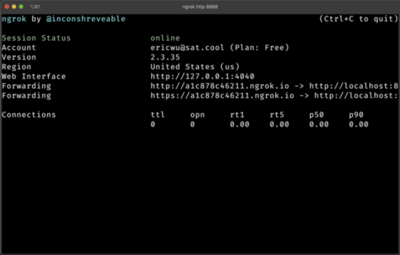
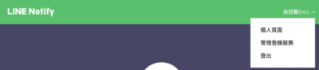
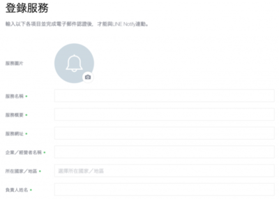
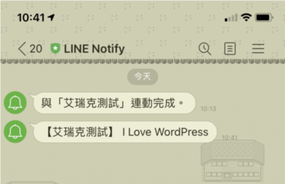

在 WordPress 上面建立 LINE Chatbot 推播外掛之前，我們需要在 LINE 平台上面處理一些事情，才可以繼續。如果你對 LINE Chatbot 已經很熟悉，可以跳過這個章節。

## 服務提供者

還記得昨天我們說的說嗎？我們站在發送訊息方的角色，所以我們需要提供一支程式或網站、和一個 callback 網址給 LINE。

等等！你說我們要一個 callback 網址？那這樣不就意味著，我要搞台主機、再搞個網址、搞完還要弄 SSL？

還好有個好工具 **ngrok** ，提供我們快速建立一個外部可存取的網站。

### ngrok

#### 安裝 ngrok

因為我是使用 mac ，我這邊建議直接使用 Homebrew 來安裝(你也可以直接官網下載解壓縮包來使用)。

```
brew cask install ngrok
```

如果你是 windows 的使用者，可以直接去官方網站中下載對應的位元版本下載，解壓縮後直接啟動 ngrok.exe 就可以囉。

#### 啟用 ngrok

我們直接在終端機輸入（我這邊示範 port 8000）：

```
ngrok http 8000
```

你會看到如附圖的畫面，會有兩個 `Forwarding`，因為 LINE 的 callback 有規範要使用 `https` ，所以我們選用第二個 `Forwarding` 來做為我們等等在 LINE Notify 訂閱通知時的 callback url：



### 登入 LINE Notify 服務

進入 [LINE Notify](https://notify-bot.line.me/zh_TW/) 網站並登入 LINE 帳號。點選右上角的個人名稱，點選 `管理登錄服務` 進入管理頁面：



點擊 `登錄服務` ： 

輸入欄位資料。（除了`服務圖片`外，其餘皆為必填欄位）。服務名稱建議設定一個好是別的，未來在發通知的時候，使用者會透過服務名稱去得知這是誰發送的通知。

而 Callback URL 欄位，則是剛剛我們複製的第二個 `Forwarding` 網址。



接著，我們要去驗證電子郵件帳號，完成電子郵件帳號驗證後，LINE Notify 服務就算登陸完成。

登陸完成後，我們可以看到 `Client ID` 和 `Client Secret` 資訊，我們先把它記下來，等等馬上會用到。


## 授權通知方

昨天我們說到，我們登陸後服務後，要使用者授權 LINE Notify 發出通知才行，所以下一步，我們要讓使用者必須進入以下網址，才能授權並且訂閱我們的 LINE Notify 通知：

```
https://notify-bot.line.me/oauth/authorize?response_type=code&scope=notify&response_mode=form_post&client_id=xxx&redirect_uri=xxx&state=xxx
```

看到這一大坨，可能就頭暈了，其實這就是一個 `OAuth 2.0` 的登入流程，至於運作原理就不在這贅述，我們只要知道使用者可以透過這個網址登入並授權通知這件事情就好。每個查詢字串的用途說明如下：

1. scope: 固定寫 `notify` 就對了。
2. response\_type: 固定寫 `code` 就對了。
3. response\_mode: 固定寫 `form_post` 就對了。
4. redirect\_uri: 填上剛剛我們複製的第二個 `Forwarding` 網址。
5. client\_id: 填上剛剛我們複製的 `Client ID`
6. state: 用來防止 CSRF 攻擊，我們填上一組亂碼就可以了。

當使用者點擊這個網址進去後，可以選擇您要接收通知的聊天室，我們也可以選擇 `透過1對1聊天接收LINE Notify的通知` 來發通知給自己。

選取完畢後，按下 `同意並連動` 按鈕即可完成訂閱，此時使用者會收到 與「服務名稱」連動完成 的通知。此時瀏覽器會重新轉址，網站會有問題，但是不重要。

順帶一提，如果訊息接收者是群組，那麼你還必須把這個 LINE Notify 帳號加入到該聊天室才可以正常收到通知喔！

## 訊息接收者

### 取得授權碼 (code)

當 授權通知方 按下剛剛那坨網址，並且點選 `同意並連動` 按鈕之後，使用者的瀏覽器會直接對 `redirect_uri` 所設定的網址發出 HTTP POST 要求，這個請求會被打到剛剛 ngrok 產生的網址。

我們接著透過 ngrok 後台 [http://127.0.0.1:4040/](http://127.0.0.1:4040/) 來看看剛剛 HTTP POST 傳入的內容，其中我們可以看到有 `code` 這個參數，先複製下來，我們等等要使用！


### 取得存取權杖 (access\_token)

#### 安裝 curl 工具

我們一樣使用 homebrew 來安裝 curl 工具

```
brew install curl
```

#### 發送 請求取得 token

任何通知訊息都需要有 Access Token 才能發出，所以我們要先請求一個 token 來發送通知：

```
curl -d "grant_type=authorization_code&redirect_uri=xx&client_id=xx&client_secret=xx&code=xx" https://notify-bot.line.me/oauth/token
```

參數說明如下：

1. grant\_type：固定寫 `authorization_code` 就對了。
2. redirect\_uri：填上剛剛我們複製的第二個 `Forwarding` 網址。。
3. client\_id：登錄服務的 `Client ID`
4. client\_secret：登錄服務的 `Client Secret`
5. code：剛剛複製的授權碼 `code`

你將會得到以下 JSON 內容：

```JSON
{
    "status":200,
    "message":"access_token is issued",
    "access_token":"xxxxxxx"
}
```

太好了，這樣我們就拿到 `access_token` 了。接著，我們就可以透過這個 access token 來發送推播通知給訂閱者囉！

#### 發送 LINE Notify 通知訊息

接著我們可以透過 `curl` 命令來發出 LINE Notify 訊息：

```
curl -H "Authorization: Bearer xxxx" -d "message=I Love WordPress" https://notify-api.line.me/api/notify
```

我們會需要在 Custom Header 放一個 `Bearer Toke`n 的 `Authorization`。所以我們要在 Bearer 後面放上我們剛剛拿到的 `Access Token`。如果成功發出訊息，也會得到 JSON 回應：

```JSON
{
    "status":200,
    "message":"ok"
}
```

並且在 LINE 上也會即時收到通知訊息：


