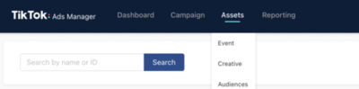
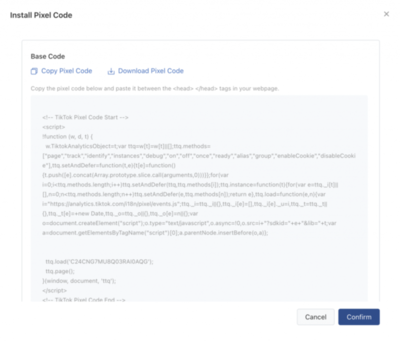

因為各種原因，個人對 TikTok 抖音有很多主觀的偏見，但是公司就要在 TikTok 上面投放廣告，所以不得不摸摸鼻子，研究一下 TikTok pixel 的安裝方式，這邊也就順便紀錄一下

其實安裝的方式很簡單，跟 Facebook pixel 差不多

<!--more-->

## 一、建立 Pixel

打開『Assets』 -> 點選『Event』。

## 二、安裝 Pixel

輸入 pixel 名稱、選擇安裝類型。安裝類型有兩種，分別是：手動安裝和透過 GTM 安裝，我這邊就只有示範手動安裝的部分。

## 三、手動安裝

選完手動安裝後，他會給你一段 base code，將這段 pixel code 安裝在網站 <head> </head> 之間 ，就完成了。

## 四、下載並安裝 Pixel Helper

TikTok 也有提供類似 Facebook Pixel Helper 的工具去 debug ，如果有需要的話，可以自行到 Chrome 的應用程式商店下載並安裝：[https://chrome.google.com/webstore/detail/tiktok-pixel-helper](https://chrome.google.com/webstore/detail/tiktok-pixel-helper)
