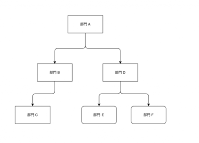

說到樹狀結構，大家第一個想法可能都是，為什麼不把樹存到 JSON 裡去？確實，使用 JSON 最大的好處就是 維護整棵樹 相對方便許多，但是當我們要去更新樹的節點、或著是查詢節點與節點之間的關係，可能就會不那麼方便。我研究了一下，最後整理出四種方式來做處理，大家可以看看自己的使用情境來做選擇。

<!--more-->

這裡我們基於 MySQL 來說明，以公司的部門來作為例子：

<figure>

[](https://ericwu.asia/wp-content/uploads/2023/03/截圖-2023-03-21-09.59.14.png)

<figcaption>

為了讓說明變得簡單一點，我畫出來的樹看起來好像只支持二叉樹，但是實際上並沒有喔。

</figcaption>

</figure>

## Adjacency List

這個方法，可以說是最為簡單且直觀的解決方法，我直接簡單暴力的加上 `parent_id` 來作為參考。如下所示表結構：

```sql
CREATE TABLE departments  (
  `department_id` int(10) UNSIGNED NOT NULL AUTO_INCREMENT,
  `name` varchar(255) CHARACTER SET utf8mb4 COLLATE utf8mb4_general_ci NOT NULL,
  `parent_id` int(11) UNSIGNED NULL DEFAULT NULL,
  PRIMARY KEY (`department_id`) USING BTREE,
  INDEX `parent_id`(`parent_id`) USING BTREE,
  CONSTRAINT `FK_departments` FOREIGN KEY (`parent_id`) REFERENCES `departments` (`department_id`) ON DELETE RESTRICT ON UPDATE RESTRICT
)

```

對了，這裡的外鍵約束，不一定要，我單純只是想要保證資料的完整性。資料表最後的呈現會長這樣：

| department\_id | name | parent\_id |
| --- | --- | --- |
| 1 | A | 0 |
| 2 | B | 1 |
| 3 | C | 2 |
| 4 | D | 1 |
| 5 | E | 4 |
| 6 | F | 4 |

### 更新

這個解決方法，在樹的更新上站有些優勢。例如，我們在 F 部門加上一個 G 部門：

```sql
INSERT INTO departments (`name`, `parent_id`) VALUES ('G', 6);
```

或者說，我們想要將 F 部門搬到 C 部門底下：

```sql
UPDATE dapartments SET `parent_id`=3 WHERE `department_id`=6;
```

  
刪除一個節點的話，可能會稍微複雜一點。

如果你要刪除的是子樹，在不使用外鍵的前提下，你需要將子樹的所有節點全部都找出來，再來一個一個去刪除他。亦或者你可以直接使用 `ON DELETE CASCADE` 的外鍵約束來去處理。

### 查詢

這個方法的查詢，就有點囉唆了，如下所示：

```sql
SELECT d1.*, d2.* FROM departments d1 LEFT OUTER JOIN departments d2 on d1.parent_id = d2.department_id;
```

  
這個查詢只可以滿足查詢兩層層級關係的樹，如果有三層或以上的話，你得自己關聯自己很多次，看起來就很臃腫。更別說當要使用聚合函數的時候會變的多可怕。

但如果你使用的資料庫是 SQL Server 2005 , Oracle 11g, IBM DB2 、MySQL 8.0 、 PostgreSQL 8.4 這些的話，他已經支持了遞迴查詢 ，或許會輕鬆一點：

```sql
WITH RECURSIVE cte AS (
    SELECT * FROM departments WHERE `parent_id`=0
    UNION ALL
    SELECT c.* FROM departments d, cte WHERE c.`department_id`=cte.`parent_id`
) SELECT * FROM cte ORDER BY `department_id`;
```

* * *

## Path Enum

為解決上面的方法的缺點，所以我們試著將他的祖先資料組合成一個字符串，直接存起來。

表結構如下所示：

```sql
CREATE TABLE departments  (
  `department_id` int(10) UNSIGNED NOT NULL AUTO_INCREMENT,
  `name` varchar(255) CHARACTER SET utf8mb4 COLLATE utf8mb4_general_ci NOT NULL,
  `path` varchar(255) CHARACTER SET utf8mb4 COLLATE utf8mb4_general_ci NOT NULL,
)
```

資料表會長這樣：

| department\_id | name | path |
| --- | --- | --- |
| 1 | A | 1/ |
| 2 | B | 1/2/ |
| 3 | C | 1/2/3/ |
| 4 | D | 1/4/ |
| 5 | E | 1/4/5/ |
| 6 | F | 1/4/6/ |

### 查詢

確實，如果我們改用這個方法後，查詢上就輕鬆很多了。例如，我們要查部門 F 的所有祖先部門：

```sql
SELECT * FROM departments d WHERE '1/4/6/' LIKE d.path || '%';
```

如果我們要查找某個部門的所有下面的部門，也很簡單，將 LIKE 兩邊的參數互換即可：

```sql
SELECT * FROM departments d WHERE d.path LIKE '1/4/' || '%';
```

### 更新

和上面的方法一樣，插入一個節點只需要複製其父節點的路徑再補充上自己的 ID 即可。 對於修改也同樣。至於刪除節點的話，需要利用查詢先找出來其所有子節點後，再一個一個刪除或更新 `path`，因此也較為省事

但是就會有 2 個問題。第一個是，因為 path 沒有外鍵對我們的資料去做完整性約束，所以我對於 path 的準確性無法給個保障，只能自己用程式去驗證。再來是，我們可以給 `path` 設一個非常大的空間來做存放，但這始終會有一個上限，這個樹可能就擴展到一個程度就會受限。

* * *

## Nested Sets

這個做法會和前面兩個做法剛好相反，它的解決方法是存儲每個子孫節點的相關訊息，會基於 `DFS` 來進行設計。也就是說，我會對於每一個節點，存儲一對左右值 `nlft` 和 `nrgt` 。

那麼如何分配節點的 nlft 和 nrgt 呢？最簡單的辦法就是對樹做一次 DFS，在深入訪問節點（即visit(node)） 的過程中遞增的分配 nlft ，並在訪問節點返回的過程中遞增分配 nrgt 。我先帶大家走一次，我們可以看到 nlft 和 nrgt 會長這樣。

[](https://ericwu.asia/wp-content/uploads/2023/03/截圖-2023-03-21-10.37.45.png)

資料表大概會長這樣

| department\_id | name | nlft | nrgt |
| --- | --- | --- | --- |
| 1 | A | 1 | 12 |
| 2 | B | 2 | 5 |
| 3 | C | 3 | 4 |
| 4 | D | 6 | 11 |
| 5 | E | 7 | 8 |
| 6 | F | 9 | 10 |

### 查詢

我們可以很方便的查找節點的祖先和後代，你可能說，這個表這麼複雜，完全看不出前後的關聯啊！其實很簡單。

當我們要查找一個節點的所有後代節點，我們可以查找所有節點的 nlft 值大於目標節點的 nlft 值，且小於目標節點的 nrgt 的集合。舉例，我們想找出 D 部門的所有下面的部門：

```sql
SELECT d2.* FROM departments d1 JOIN departments d2 ON d2.nlft BETWEEN d1.nlft AND d1.nrgt WHERE d1.department_id = 4; 
```

反之，當我們要查找其祖先節點，只需要查找目標節點的 nlft 值位於哪些節點的 nlft 和 nrgt 值之間，則對應的節點即為其祖先節點。假設，我們又想找出 D 的所有上面的部門：

```
SELECT d2.* FROM departments d1 JOIN departments d2 ON d1.nlft BETWEEN d2.nlft AND d2.nrgt WHERE d1.department_id = 4;
```

不過對於這個方法有個小問題，那就是假設我要找直接祖先或者直接後代，就會有問題了。我會需要找到節點 N 的所有祖先節點內的一個節點和節點 N 之間不存在任何其他節點。反之，找出直接子節點也類似的做法。舉例，我想找出 D 的父節點：

```sql
SELECT parent.* FROM departments d JOIN depatments parent 
    ON d.nlft BETWEETN parent.nlft AND parent.nrgt 
  LEFT OUTER JOIN departments in_between 
  ON d.nlft BETWEEN in_between.nlft AND in_between.nrgt 
  AND in_between.nlft BETWEEN parent.nlft AND parent.nrgt 
WHERE d.department_id = 4 AND in_between.department_id IS NULL;

```

### 更新

  
這個方法的更新是相當複雜的：比如說我們要插入一個新的子節點時，得需要去重新計算其兄弟節點、祖先節點以及祖先節點的兄弟節點，確保其左右值都要比這個新節點的 nlft 要大；當這個節點還是一個非葉子節點時，還要處理其子孫節點的左右值關係。例如，我們要在 E 部門下面加個 G 部門：

首先，我們要先給新節點新空間

```sql
UPDATE departments SET nlft = CASE WHEN nlft >= 9 THEN nlft+2 ELSE nlft END, nrgt = nrgt+2 WHERE nrgt >= 8;
```

然後插入新的節點

```sql
INSERT INTO departments (name, nlft, nrgt) VALUE ('G', 8, 9);  
```

* * *

## Closure Table

這是一個簡單且優雅的方法，它利用空間去換時間，記錄了 樹中所有節點間的關係 。

我們需要另外創建一個 department\_tree 表，這個表只有簡單的紀錄 『父子』 關係。在這裡，我們將每一個節點都存在一個指向自己的父子關係，最後得到兩張表：

<figure>

| department\_id | name |
| --- | --- |
| 1 | A |
| 2 | B |
| 3 | C |
| 4 | D |
| 5 | E |
| 6 | F |

<figcaption>

depatments

</figcaption>

</figure>

<figure>

| parent | child |
| --- | --- |
| 1 | 1 |
| 1 | 2 |
| 1 | 3 |
| 1 | 4 |
| 1 | 5 |
| 1 | 6 |
| 2 | 2 |
| 2 | 3 |
| 3 | 3 |
| 4 | 4 |
| 4 | 5 |
| 4 | 6 |
| 5 | 5 |
| 6 | 6 |

<figcaption>

department\_tree

</figcaption>

</figure>

### 查詢

我們可以直接透過 department\_tree 這張表去做查詢。例如，我們要找出 D 部門上面的部門：

```
SELECT d.* FROM departments d JOIN department_tree t ON d.department_id = t.parent WHERE t.child = 4;
```

當然，我們也可以找出 D 下面的部門：

```sql
SELECT d.* FROM departments d JOIN department_tree t on d.department_id = t.cild WHERE t.parent = 4;
```

那有可能我們要查詢直接父子節點，所以我們要來最佳化 department\_tree 這張表，我們新增一個欄位 `path_length` 表示這個父子關係的層級，如果是自己引用自己的話為 0 ，依次遞增。當我們需要查詢直接父節點或直接子節點的時候，可以直接帶上查詢條件 path\_length=1 即可。

### 更新

對於新增一個節點，比如給部門 D 的下面多一個部門 G，很簡單 。

首先要在 departments 中插入一筆記錄 (7, 'G') ，然後在 department\_tree 中創建一筆記錄 (7, 7) ，然後再找出子節點為部門 D ( 也就是 department\_id 為 4 的節點 )，給他們加上一個和部門 G 的父子關係到 department\_tree 中。

那如果要刪除一個節點呢？我們會需要先刪除 department\_tree 中以 child 為對應節點的所有記錄。假設我們要刪除部門 C：

```sql
DELETE FROM department_tree WHERE child = 3;
```

假設我們是刪除一個子樹，那後代節點也要處理一下：

```sql
DELETE FROM department_tree WHERE child IN (SELECT child FROM department_tree WHERE parent = 4);
```

* * *

## 該如何取捨？

可以根據實際的應用場景來去選擇適合自己的數據結構，優缺點如下：

|  | 優點 | 缺點 |
| --- | --- | --- |
| Adjacency List | 直觀方便、設計簡單 | 臃腫的查詢 ( 但是如果你選擇的資料庫可以做遞迴查詢，而且你的資料庫效能也不差，那就不會是問題 ) |
| Path Enum | 祖輩關係直覺 | 消耗空間、使用 LIKE 操作效率不好、資料的完整性沒有保障 |
| Nested Sets | 查詢無遞歸顯得非常高效、同時空間佔用低 | 維護複雜 |
| Closure Table | 在查詢和維護的高效和簡潔中取得一個平衡 | 需要點空間去換時間 |

不知道大家有沒有其他的做法，歡迎分享討論。
