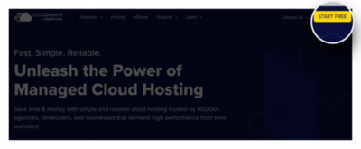
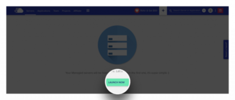
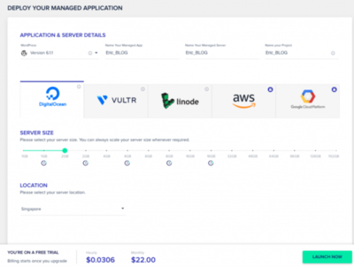

接著，要說明如何開啟 WordPress 主機。

你可能會很緊張，什麼？你說主機？是不是要開什麼軟體？寫什麼程式？先不用這麼緊張！全程都只要透過網頁進行操作就可以了！所以你可以放鬆心情，來跟著我一步一步做下去。

<!--more-->

## 主機是什麼

💡 主機是用來專門用來放置網站的「空間」，可能是一台電腦或是共享一台電腦。

你可能會說自己家的電腦主機也可以是網站主機嗎？我的答案是可以。但是！你想想...

- 因為你不知道訪客什麼時候會來，如果是不是得要 24 小時都開著電腦？

- 24 小時開著，是不是還要考慮電費、冷氣費 (一直開著電腦可是很燙的)？

- 你家的網路夠穩定嗎？

- 你家裡的網路費是不是要夠快？

- 你有辦法維護硬體嗎 (開 24 小時，主機一定會耗損)？

- 若 100 個人同時上線 (或是更多) 你的電腦撐得住？

人生苦短，還要思考這些問題，太麻煩了！所以大部分的網站都還是會**選擇專業主機代管公司所提供的主機空間**。

你可能又會問，主機的費用會不會很貴？這個我不敢直接斷言，但是以我們剛開始學習用的規格來說，大概是每個月五百元到八百元左右。而之後隨著網站的規格需求提高，當然會有相對應的成本漲幅。

## 註冊 Cloudways 帳號

我們今天會使用主機服務商 Cloudways。我們可以透過下面連結進入 Cloudways 的首頁。

👉 [Cloudways 連結連結](https://www.cloudways.com/en/viral-loop.php?referralCode=ogfsgfv&refSource=copy&redirect)

一、我們點擊右上角的 Start Free 按鈕。

二、你可以透過社群帳號快速註冊，或是手動填寫註冊資料來完成註冊。  

三、註冊完成後，我們會看到這個頁面，那就大功告成了！  

建立主機

一、點選 LANUCH NOW ，開啟主機建立流程。  

二、我們會在這個步驟告訴 Cloudways 我們要的主機規格。

- Application: 我們直接**選擇 WordPress**，他會選擇預設的最新版本 (本文撰寫於 2023/09/03 ，當下提供的最新版本為 6.2.2)， App 名稱、Server 名稱、Project 名稱，可以自己隨意命名。

- Server: Cloudways 提供的主機商有 DigitalOcean, Vultr, Linode, AWS, GCP ，各有各自的優缺點，但是都是有名氣的主機商，所以品質和穩定度基本上都不用擔心。大家可以比較參考，看你的預算，還有未來預計的流量。那我們這邊選 **DigitalOcean** 作為範例。

- Server Size: 因為我們只是學習的話，所以先選個 **2GB** 的建議就夠了。

- Location: 我們選擇離我們比較近的 **Singapore** (新加坡)。

都選好後，底下會有簡單的試算，我們可以透過這個價錢的試算知道一個小時會花去多少費用 (美金計價)？一個月會花去多少費用 (美金計價)？。如果確認都沒問題的話，我們就可以點選 **LANUCH NOW** ，來啟動我們的第一台主機。

接下來大概要等個幾分鐘的時間，系統會幫我們自動完成主機的建置。到這邊就會完成了我們第一台主機的設定了。

也確實和一開始說好的，我們都沒有碰到半點程式或是艱深的主機設定吧！

接著的單元，我會教大家**如何購買給網站的網域**，並且連結到剛剛建立好的主機。

加油！我們就快要可以看到第一個自已的網站了！
