這個單元你將會學到什麼是網域？以及我會帶各位購買自己的網域，連接到剛才啟動好的的 WordPress 網站主機。

<!--more-->

## 什麼是域名

在這之前，我們要來聊聊，什麼是域名？我很喜歡把域名比喻成「指向你家地址的路牌」。怎麼說？因為在網際網路的世界中，每一個網站都有一個獨特的地址，稱為 IP 地址，它是一串由數字和點組成的序列，例如 123.45.67.89。但是，這些數字序列實在很難記住，也不太直覺。

這時候，域名就派上用場了。域名是一種更人性化、更易記的方式來指向這些數字地址。例如，將 「google.com」 關聯到 Google 的 IP 地址。這樣，當你想要訪問 Google 的網站時，你只需要在網路瀏覽器中輸入 "google.com"，而不是一長串的數字。

域名不僅使得記憶和進入網站更為簡單，它還可以幫助建立品牌識別和信任。當你擁有一個域名，它就像是你在網際網路上的專屬名片，讓人們更容易找到和記住你的網站 (或是知道你在做什麼)。

認識域名後，我們就要先來了解**域名的費用**。首先我們要先來知道一個網域的費用，費用的話是依照每年去計費。通常，第一年的授權都會有優惠，便宜一些，第二年開始就會恢復原價。另外，不同的頂級域名也會有不同的費用。

首先，我們會需要先去申購一組網域來用，這邊的教學，我們會用 **Namecheap** 來做示範，網址在下面。

👉 [Namecheap 連結](https://www.tkqlhce.com/click-100599602-14326263)

## 購買網域

一、到 Namecheap 網站上，直接輸入想要買的網域名稱，比如說這邊打上 ericwu，按下 **Search** 。  
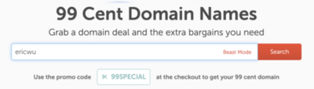

Namecheap 會列出所有可以購買的網域和網域的價格，我們可以找一個自己喜歡的網域買來用。  
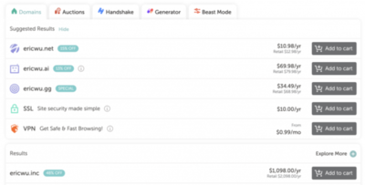

二、我們看到喜歡的網域，可以點選 **Add to cart** ，來加入購物車。  

三、加入後，會跳出一些加購商品，那我們可以直接點選右下角的 **checkout**。  

三、進入結帳頁面。這邊會有個 **AUTO-RENEW** ，就如同字面上的意思，就是網址要不要自動續約。我會建議開著，避免一年後忘記去續約。  
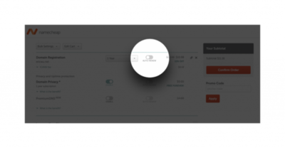

如果都沒有問題的話，可以直接點 **Confirm Order** 。  

四、接下來是註冊帳號的步驟。我們依序填入 Username (帳號名稱)、Password (密碼)、Confirm Password (密碼確認) 以及 First Name (姓氏) 、 Last Name (名稱) 和 Email Address (信箱) 後，點選 **Create Account and Continue** 來完成註冊。  
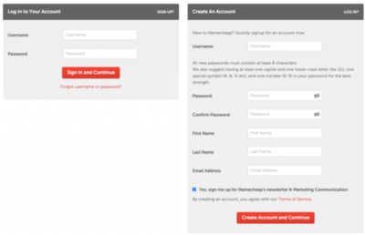

五、這個步驟要輸入的是基本聯絡資訊，這邊要使用英文填寫。這些資訊請務必真實填寫，讓負責該頂級域名的單位可以備查。順帶一提，這些資訊在網域所屬的公開聯絡資料中都可以被查到喔！填寫完後就點選 **Continue** 。  

六、再次確認要提供給 Whois (全球網域名稱查詢系統) 的聯絡資訊。如果沒有問題的話，就點選 **Continue** 。  
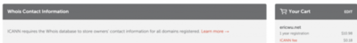

七、再來就是要結帳，結帳方式非常多元，看是要刷卡還是要用 PayPal 支付都可以。結完帳之後，就可以看到購買完成的頁面。  
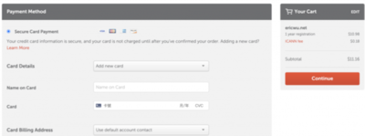

八、確認一下付款資訊有沒有問題，沒問題後點選 **Pay Now**，如果購買成功的話，應該可以看到 「 Thank you for your purchase! 」，如此一來就完成我們網域的購買和申請了  
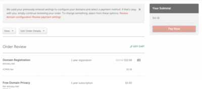

九、應該會收到三封信，其中一封信件的標題是 **IMMEDIATE VERIFICATION required for your domain(s)** ，務必打開後點擊 **Click here to verify your email address** 驗證你的信箱正確。  
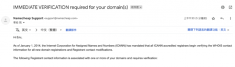

💡 這個步驟很重要，很多人都忘了，導致域名失效。

如此一來，看到這個畫面就代表著我們就擁有一個自已的專屬域名了。  
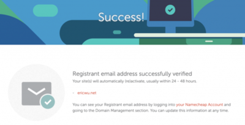

## 指向 WordPress 網站主機

接下來我們要做的事情是，將這個網域對應指向到我們剛剛啟動的主機。

一、我們回到 Cloudways 上，進入剛剛啟動好的主機。點選右上角的 **www** ，進入應用程式管理。  
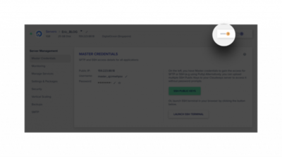

二、選取你設定的應用。  

三、進入 **Domain Management** 後，點選 **ADD DOMAIN**。  

四、輸入我們剛剛註冊好的網域，點選 **ADD DOMAIN**。  
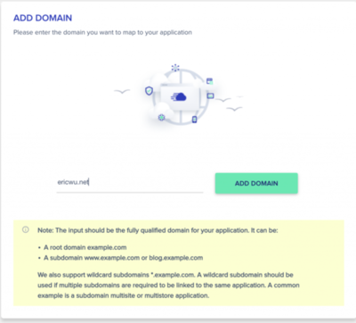

五、我們再次回到 Namecheap 來到 DNS 管理設定的地方，點選剛剛購買的域名旁邊的 **MANAGE** 。  
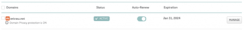

六、點選上面的 **Advanced DNS** ，來管理 DNS 紀錄。

七、我們點選 **ADD NEW RECORD** ，來在這邊增加一組 A 紀錄。  

**Host** 這欄位輸入 **@** ，**IP** 貼上剛剛在 Cloudways 複製的 **IP** ，好了後，就點選綠色勾勾確認，就完成設定了。

八、回到剛剛 Cloudways 的應用程式管理。點選 **ACCESS DETAILS** ，我們可以看到以下資訊，這可以讓我們進入 WordPress 管理後台登入。  

九、進入後台後，我們點選左側選單的 **Settings** 下面，子選單的 **General** 進入 General Setting。  

十、換上我們剛剛購買的網域。  
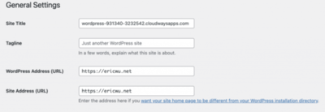

這樣我們就可以直接透過剛剛買的網域，進入了我們啟用的網站了。
