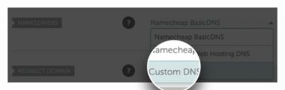
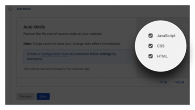
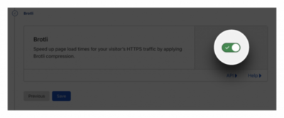

現

在有了主機，也有了網域了，接著我們會來講怎麼加快網站載入速度。

💡 這個章節不會影響後續的建站，如果你覺得網站快不快或是安全不安全不重要，或許可以跳過。

我們會選用 Cloudflare 來做範例，**Cloudflare** 提供的 CDN (網路內容遞送) 技術可以解決這些問題。

<!--more-->

用之前，我們先來聊聊什麼是 **CDN 技術** 。CDN 全名是 Content Delivery Network 或C ontent Distribution Network，我們習慣簡稱 CDN 。他是一種透過將你的網站建立很多分身，然後分佈在全世界的資料中心，如此一來可以縮短使用者和網站資源間的距離。換句話說就是今天使用者來到你的網站，會優先選擇離他地理位置比較近的伺服器去取得你的網站資料。這樣傳輸時間就會變短，網站載入速度就會變快許多。

另外，Cloudflare 還會協助我們防止常見的駭客 DDoS 分散式阻斷服務攻擊。什麼是 DDoS 分散式阻斷服務攻擊？這是一種很常見的攻擊，駭客會透過惡意大量進入我們網站，導致網站流量異常擁擠甚至掛掉，我們就會沒辦法服務正常的使用者。所以無論你網站的規模大小，都需要面對並提早預防，那怎麼做呢？

我們只需要簡單地按一按，Cloudflare 就會協助我麼處理這些問題。而且，Cloudflare 很佛心的提供了**免費版本**，所以真的很建議使用看看。我們馬上點選下面連結，進到 Cloudflare 網站，來開始 Cloudflare 的教學。

👉 [Cloudflare 連結](https://dash.cloudflare.com/sign-up)

## 註冊帳號

一、輸入 **Email address** (信箱) 和 **Password** (密碼) 後，點選 **Sign Up** 。  

二、點選右上角的 **Add site** 來加入我們的網站。  

三、輸入我們剛剛購買的網域後，點選 **Add site** 。  

四、接著會進入方案選擇頁面。一開始可以先**選免費**的就好，等之後想要更好的服務還可以再升級，選好後點選 **Continue** 即可。  

五、接下來 Cloudflare 會自動掃描我們網站的 DNS 紀錄。掃描完成後，再次點選 **Continue** 即可。

## 更改 DNS 伺服器

在這個小節開始前，我們先來聊聊 DNS（Domain Name System）伺服器。當我們在瀏覽網頁、發送電子郵件或是執行許多網路上的操作時，我們都會使用到 DNS（Domain Name System）伺服器。可以把它看成像是「電話簿」。還記得我們前面的單元說的，我們買域名，而域名就是為了連到那些不好記憶的 IP 地址。而誰去紀錄誰轉到誰？那就是 **DNS 伺服器**。

所以這個小節，我們會教大家「如何記錄到電話簿」。

一、回到購買網域的網站那邊（不要關閉 Cloudflare 的分頁喔），在 **Domain List** 這個頁面，選我們剛剛購買的網域右邊的 **MANAGE** 後，點選 **Domain**。  

二、我們進入 **NAMESERVERS** ，選擇 **Custom DNS** ，貼上 Cloudflare 提供的兩組 nameservers ，分別是：

1. elaine.ns.cloudflare.com

3. fattouche.ns.cloudflare.com  
    

三、按下**綠色勾勾**確認。  

四、回到剛剛沒有關掉的 Cloudflare 分頁，點選 **Done, check nameservers** 確認。  

這樣我們就成功「記錄到電話簿」了。

## 最佳化效能

接著可能會跳出 Cloudflare 建議設定，我也覺得這個建議很重要，所以我就依序介紹 (當然了，你也可以跳過) 。

一、確認要不要**自動改寫 https 規則**。這樣會將我們所有連結都從 http 自動改寫成 https 。現在的網站為了提供更好的安全性和隱私保護，並有助於提高網站在搜索引擎中的排名，有 https 已經是基本功了，所以我們一定要打開。打開後，按 **Save** 。  

二、確認要不要**總是使用 https** 。如此一來確保所有請求都是 https 。也是打開後，按 **Save** 。  

三、再來是我們在讀取網頁時會有的 JavaScript、CSS 和 HTML 要不要做壓縮，這邊是建議**全部勾選**，經過壓縮後的網站，在讀取速度上會提升很多，使用者體驗和日後在搜索引擎中的排名也是加分的。也是好了後，按 **Save** 。  

四、最後的 **Brotli** ，這個也是有機會提高網頁的載入速度的選項，Brotli 是基於 Google 所開發的無損壓縮演算法，啟用後可以有效加快網頁載入速度，也是建議打開。也是打開後，按 **Save** 。  

五、最後點選 **Finish** ，這樣我們就成功透過 Cloudflare 進行效能與安全性的最佳化了。

現在，我們有了一個相對安全和相對快速的網站了。網站又平安的過去了，感謝 Cloudflare 的努力！
