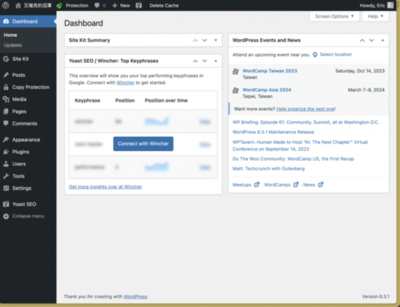
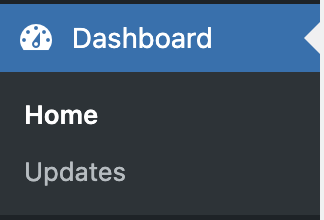
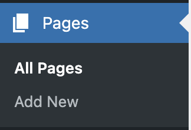
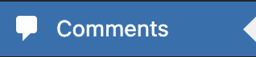
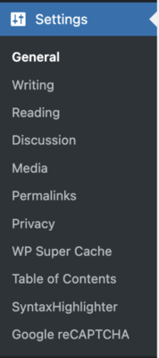

太好了，我們設定好了我們的第一個網站！這是一個已經上線且公開的網站，所以任何人都可以直接透過剛剛你購買和設定的網域進去你的網站。那我們接著的目標就是要努力的去完善這個網站，俗話說「工欲善其事，必先利其器」，要完善這個網站，我們得先來認識一下 WordPress 的後台。

<!--more-->

## Hello WordPress

進入 WordPress 後台的方法，前面的章節已經說過了，這邊就不贅述了。

登入後，就會看到我們 WordPress 的控制台了。

之後有關網站上的功能、文章撰寫或網頁設計等等，都會在後台上面處理，所以認識後台非常的重要。也因此我們會依序介紹左側選單的分類下有什麼功能：

### Dashboard (控制台)

在控制台這個頁面，我們可以看到整個網站的概況，而如果所在地附近，有 WordPress 的活動，也會顯示在這裡（我也會不定時出現在線下活動，歡迎大家來找我交流）。

同控制台底下，有個很重要的選項是**更新**，之後網站經營的期間呢，一定會有新的 WordPress 版本，還有佈景主題跟外掛這類的需要更新，只要有新的更新，這邊就會亮起來提示。

如果是 WordPress 的版本更新，我會建議你一定要先備份才更新。以往的經驗，重大的更新有時候會造成一些意外，這會讓已經上線的網站不能運作。至於怎麼備份？會在後面的章節會提到。

💡 通常如果是關於資安方面的維護更新，基本上會建議都要更新。

### Posts (文章)

**文章**是用來負責管理文章、分類和標籤的地方。如果你是要寫部落格的朋友，就會常常使用這個功能。

你可以點這寫新的文章，目前 WordPress 的文章編輯器是使用 Gutenberg 區塊編輯器。比起前幾年來說已經有了很大的改變，可以讓我們可以更好地撰寫文章跟排版。

再來是**分類**和**標籤**的功能，一樣是在在這。順帶一提， WordPress 中的分類 (Categories) 和標籤 (Tags) 都用於對內容進行組織和分類，但它們之間還是有些許的差異。

分類的話主要用於將內容歸納為大類別或主題，所以會有層次結構，就是可能有主分類和次分類，以更有順序的去組織文章。標籤則用於新增關鍵字，以更精確地描述內容的特定屬性，他就沒有這種層次結構，每個都是獨立的關鍵字，通常也會給很多個。

### Media (媒體)

**媒體**是管理你所有在 WordPress 上的圖片、影片…這類的媒體資源，我們可以在這邊上傳、管理和編輯。

### Pages (頁面)

**頁面**是讓你可以在你的 WordPress 網站上建立網頁。一個網站是由很多個網頁建立而成，每一個頁面都代表著一個網頁，我們可以透過新增與編輯頁面，來設計出我們的每一個網頁，至於如何設計出網頁呢？我會在後續的章節和大家分享。

### Comments (留言)

**留言**是可以瀏覽所有人在你文章下面的留言，並且可以管理留言。

### Appearance (外觀)

**外觀**這的話，是可以控制網站的整體樣式設計，包含佈景主題的安裝和管理，也是在這裡進行。還有其他，像是說自定義網站基本外觀樣式的設定或是要編輯網站選單跟小工具，都可以在這裡設定。

### Plugins (外掛)

外掛可以讓我們的 WordPress 網站增加許多功能。WordPress 官方提供一個外掛目錄給我們，我們可以在上面找到各種好用的 WordPress 外掛來安裝，讓我們的網站有更多的想像。

### Users (使用者)

**使用者**這個功能，讓我們可以在這瀏覽這個 WordPress 網站上的所有帳號。也可以在這新增編輯帳號或是角色相關的設定。

### Settings (設定)

**設定**的話，涵蓋了很多功能，許多網站許多基本設置都在這，例如網站標題名稱或是之後有一些常見的基本設定都會放在這。又或者是像是我有裝一些外掛，一些外掛的基礎設定也都會放在這裡。

以上就是整個 WordPress 網站後台的簡單介紹，這邊也恭喜你成功上線了第一個 WordPress 網站，並且順利的進入後台，對 WordPress 有了初步的認識。 🎉

接下來，我們要做的就是將網站本身的完成度提高！
