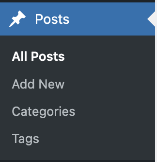
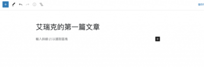
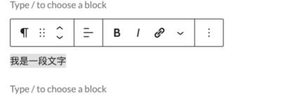
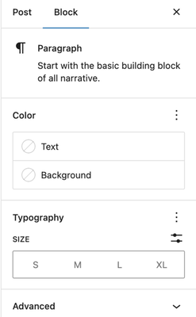
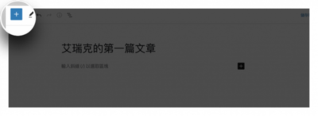
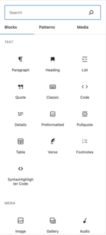
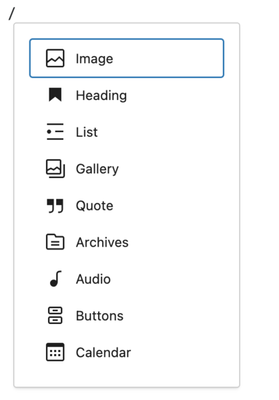
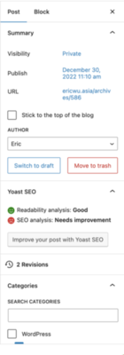
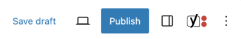
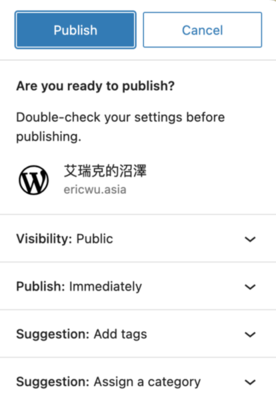

WordPress 作為一個優秀的部落格軟體和內容管理系統，文章是重要的核心之一。尤其是如果我們要經營一個部落格的話，一定會常常文章這個功能。因為無論你是經營個人或是公司的網站，在做完網站首頁跟其他頁面後，一定要經常來增加文章內容。畢竟要有好的內容，才可以讓網路上的大家更容易看到你，或者是知道你或你的公司在做什麼。

所以，這個章節我們會來試著發佈我們的第一篇文章。

<!--more-->

## 文章

首先，我們可以從 WordPress 的後台，看到 Posts (文章) 這個選項。

我們會看到四個功能，我們依序介紹：

**全部文章**：我們所有撰寫過的文章，都會整理在這裡。在這裡我們可以很快速的去檢視 / 編輯 / 刪除，管理我們全部的文章。

**新增文章**：我們可以直接點擊這個打開文章編輯器，開始一篇新的文章。

**分類**：為了更方便管理所有文章或是讓網站讀者找到感興趣的文章，建立好分類是非常重要的步驟，依照不同類型的網站或部落格，會出現不同的分類，例如：美食部落格，可能就會以食物類型作為分類的依據。所以我們可以花點時間規劃一下分類，讓來看你的網站讀者更好找到他要的資料。

**標籤**：這功能跟分類很類似，通常是以文章主題下去做新增，比如剛剛提到的美食部落客，就可能會有韓國美食、日本美食這些標籤，可以方便網站讀者找到相關的主題標籤下面的文章來做閱讀。

## 新增文章

### 撰寫內容

接下來，我們來新增我們的第一篇文章，從 WordPress 更新到第五代後，使用了新的 Gutenberg 區塊編輯器，可以說是大幅的幫助我們寫出更加優雅和豐富的內容。

當我們進入這個文章新增頁面，我們可以先來取個文章標題，標題很重要，他可以讓網站讀者第一眼就知道這篇文章是在講什麼內容。

接著我們可以輸入內容，如果你的內容想要變更格式的話，我們可以直接反白想變更的文字後，就可以操作。

那如果我們要新增標題，也是直接透過編輯器來更改，並有多種標題標籤可以選擇。通常文章分段用的標題會從 H2 起跳，因為 H1 會留給這篇文章標題本身。那更下面階層的小標題就會選擇 H3 或是 H4 以此類推。

右邊的 **Block** 也有一些比較細節的設定，在不同類型的 Block 下，會有不同的設定，像是文字可以調整大小或顏色，圖片的話可以調整要方的要圓的。因為細節很多，所以這邊就不一一介紹了，大家可以自己試玩看看。

除了邊打文章的時候邊改格式，我們也能透過左上的 **「 + 」** 按鈕，來看看編輯器裡有哪些元件可以利用。

這邊不僅有許多文章常見的格式能做選擇。

也可以插入多媒體的內容加到文章當中，像是文字、圖片、影片或嵌入連結，有別於傳統的文字編輯器，我們可以更快的去豐富我們的文章的內容。另外，這裡是可以直接使用快捷鍵的。在文章區塊中，直接按下 / 就會跳出一些常用的元件可以選擇。

💡 如果你平常有用 Markdown 的習慣的話，Gutenberg 區塊編輯器也是支援的喔！

### 文章摘要

寫好文章還有一些摘要需要去設定。我們可以在右邊的這區找到。

像是說**自訂網址**，我們可以自訂這篇文章在網址上的會長怎樣。或是**修改文章發佈時間**，我們可以預先排程或是調整發佈時間，或是來**新增文章分類**以及**新增文章標籤**，又或者是修改文章的可見度 (私密？公開？需要密碼)。

還可以在這邊選一張圖片來當作**精選圖片**。什麼是精選圖片呢？他是文章或頁面的一個主要圖片。這個圖片通常用於代表該內容，並在文章列表、標題上方或是社群網站分享時顯示，所以好的精選圖片能夠增強內容的吸引力。

這邊也可以去修改內容摘要，通常就是放上本篇文章的重點資訊。

建議這些設定都要勤奮一點的把它好好的處理完，這些都會讓文章有長期的效益。

### 發布

最後，文章寫到了一個段落，我們可以到右上角。假設如果我們還不想發布的話可以點擊**儲存草稿**，或是想看看文章發布後的結果也可以點擊**預覽**。如果一切都沒問題的話，就可以點 **Publish** 了。

然後，WordPress 會很貼心的再跳出一個最後確認的通知，沒問題的話，就點 **Publish** 吧！

當我們發布成功後，左下角會跳出一個 「Post Published」，這樣我們就成功的在 WordPress 網站上寫第一篇文章囉！

以上就是 WordPress 的文章編輯器的使用。
