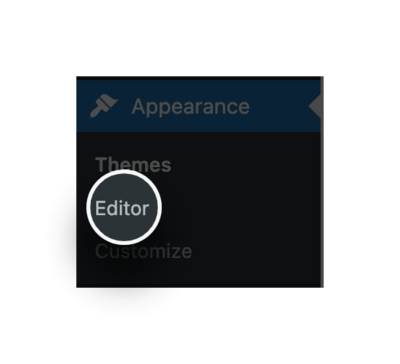
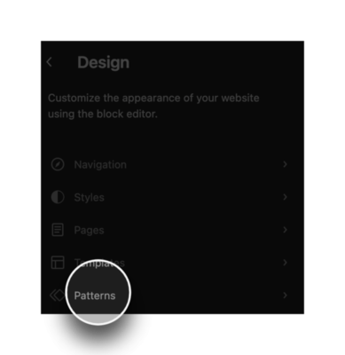
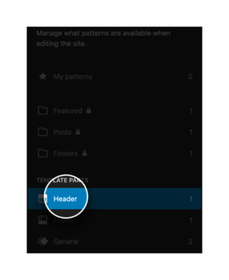
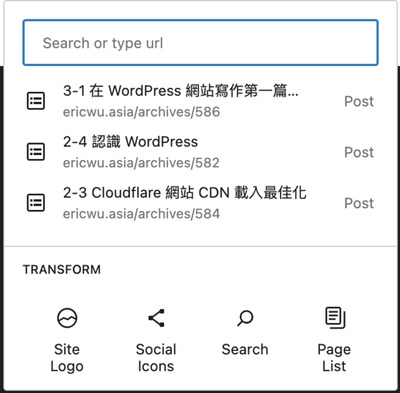

這個單元我們要來處理的是頁首選單 (Header) 和 頁尾 (Footer)。

<!--more-->

## 網頁的組成

開始之前，我們先來理解一下一個網頁通常大架構上會分成 Header, Content 和 Footer 這三個部分，大概是這樣：

其中，中間的 content 也就是內容，會因為每個頁面不同而有不同的內容 (例如：文章、頁面的變更) 。但整體來看，整個網站裡面的每個網頁，上面的 header 和下面的 footer 都是共用的不會去變更。所以，我們習慣會在上面放一些可以讓使用者快速找到重要的網頁連結資訊，因此這裡有導航、導覽的重要意義。

那這個單元我們會先來介紹 header 和 footer 的調整。

## Header

**頁首 header** 通常是固定在網頁最上方的，一般來說會放品牌 logo 、重要頁面連結、搜尋或是社群媒體連結等等，因應不同的主題佈景，能放的東西也會不一樣。

選單會預設放上目前網站所有的頁面，這些是我們可以自定義的。如果你看到網路上比較舊的文章，會跟我們說可以到 WordPress 後台進入 Appearance (外觀) 裡面的 Menus (選單) 或是裡面的 Customize (自訂) ，有些佈景主題有支援讓你可以在這修改 header 。不過，在新的 WordPress 版本中，我們可以很方便的直接透過最新的 Gutenberg 區塊編輯器去做修改。

一、首先點擊 Appearance (外觀) 裡面的 **Editor** (編輯器)，進入 Design 頁面。

二、打開 Design 頁面後，我們點選 **Patterns** ，來看到我們可以編輯的 Pattern 們。

三、那我們是要編輯 header ，所以我們選 **header** (如果你是要編輯 footer ，就改成點 footer)。

四、點擊**要編輯的 header** 。

進去後，就可以開始編輯選單名稱、透過拖拉的方式排序和調整階層。

五、如果你還想要自定義更多的細節，我們也可以點擊右邊的 **+** 號，來新增區塊。

六、此時，會跳出一個選單，我們可以新增頁面、新增連結來加入連到其他網頁的超連結、或者可以加上 Facebook 粉絲頁的連結、蝦皮商城的連結、或者是加入網站的 Logo、又或者是加入搜尋框。總之，有什麼重要的資訊想跟網站讀者第一眼就看到，都可以放在這。

## Footer

**頁尾 footer** ，通常則是放在最下方，給網站讀者大致看完整個頁面後，能夠得到更多延伸重要資訊的地方。我們想像看看，今天網站讀者來到我們網站，滑到最底部後，就突然沒有東西看了，那他可能就會一臉錯愕，然後就離開了我們的網站，那會很可惜。所以， footer 頁尾就是這樣的一個存在。所以我們常常會用來放一些比如說商店的營業時間、地圖、聯絡電話或是整個網站頁面的總覽。還有些網站也會放上社群媒體連結等等資訊，為的是使用者不單只是看完網站，而是可以去引導使用者來產生更多後續的互動。

同樣的，如果你看到網路上比較舊的文章會跟我們說可以到 WordPress 後台外觀裡面的自訂 footer 來做修改。還好，感恩 WordPress 的工程師，感謝他們在最新的 WordPress 版本中，讓我們可以直接透過 Appearance (外觀) 裡面的 **Editor** (編輯器)，來修改我們的 footer 。

所以， Footer 也是可以直接透過最新的 Gutenberg 區塊編輯器去做修改。同樣的，我們也可以直接在這放上我們想要的圖片、文字、連結。方法基本上都和 header 一樣，所以這邊就不多做贅述了。

以上就是在 WordPress 裡做出 header 和 footer 的方法。你也可以透過外掛 (比如說 Elementor, Divi) 的方式來客製化自己的 footer 或是 header ，這邊重點不在這，所以也不會在這討論。
