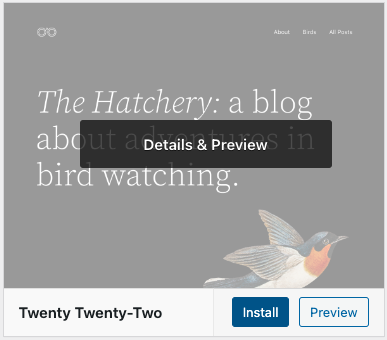
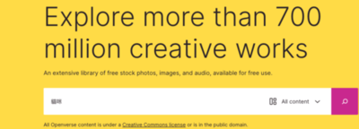
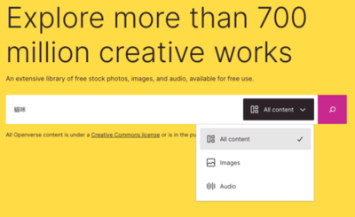
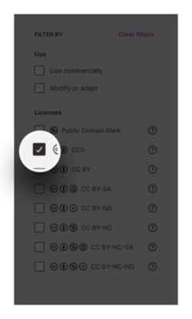
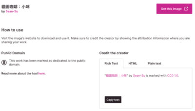

接著我們會來介紹 WordPress 的核心功能之一**佈景主題**。當我們今天已經成功架設好 WordPress 網站，並已經做好基礎的前置作業，也有了豐富的內容了 (文章或是頁面) ，下一步就是幫自己的網站選個喜歡的 Theme (佈景主題)。

<!--more-->

一個好的佈景主題除了可以讓網站更有設計感之外，還可以吸引使用者進來。WordPress 提供了很強大的佈景主題核心，其可拆解性和高客製程度，讓我們不只是單純套套板而已，還可以製作很多客製化，讓我們加速網頁製作的流程。

## 佈景主題

### 如何使用

在 WordPress 後台，直接提供了完整的佈景主題核心，操作相當簡單。

首先，我們點選 Apperance (外觀) 的 Themes (佈景主題)。

打開後，可以看到我們安裝的佈景主題。另外 WordPress 本身也會內建幾款佈景主題可以做使用。基本上 WordPress 每年都會有一款官方的主題釋出，可以看到是以西元年來做命名。

我們可以透過上面的 Add New (安裝佈景主題) 的按鈕，進入官方的佈景主題目錄。

這邊有更多基本款的佈景主題，找到喜歡的佈景主題，可以先透過 Preview (預覽) 來先看看主題佈景是不是真的符合自己的需求。接著再透過 Install (安裝) 和 Activite (啟用) 動作來使用佈景主題。

### 挑選標準

大家可能會好奇，如何選一個好的佈景主題，能夠讓我們有更舒適的開發和設計體驗？以及有哪些要注意的地方呢？這邊可以給大家一些建議。

#### 有無 demo ？

首先，我們可以先觀望看看有沒有套用這個主題的相關官方 demo 範例，這樣可以先看看這個主題適不適合你的網站，進而延續這樣的感覺，去改造成自己想要的網站，過程就輕鬆許多。

#### 需要大量素材？

另外，很多佈景主題，都是靠著專業的照片去撐起來的，所以我們也要去思考，我們是否有能力去準備這些照片，比如說自己來拍產品？還是說要找專業攝影師幫商品進行整組商業攝影？那如果沒辦法負擔的話，這主題還會好看嗎？(不過也不用太擔心，下面我會來介紹一些實用的素材來源。)

#### 字體支援度？

接著是字體的部分。有許多人啟用主題後，會發現主題怎麼換了中文字就開始崩壞，畢竟不少佈景主題由於都是國外的公司所販售，皆是以英文的文字做呈現。畢竟這些字體都是有情感在裡面的，所以我們可能也要去考慮網頁字型 (Webfont) 是否需要購買使用。那後面的章節也會教大家如何安裝網頁字型。

#### 客製化彈性？

接著我們也要考慮一下客製彈性。有些主題雖然真的很好看，但是樣式寫得很死，要改一些東西就完全改不了，甚至是找半天都還不知道要去哪邊做設定，甚至要學習 CSS 才能去修改，那就要認真思考適不適合我們。

現在很多主題都有提供好操作的介面可以用，我們可以直接進入外觀的自訂，能夠輕鬆將網頁改成自己要的樣子

#### 效能考慮？

再來就是考慮到佈景主題的效能。有些佈景主題非常龐大，也就是俗稱的「很肥」，這會拖垮網站的運作速度，會讓使用者進入你的網站的速度變很慢，那就會大幅度的增加使用者的跳出，那也不是我們樂見的。所以，通常我們在架站的時候，會同盤的去考慮佈景主題和外掛會不會影響效能，如果會的話，這個是必須的嗎？如果是的話，有沒有其他相對輕的替代方案？

綜合以上幾個選擇條件，也許我們就能找到一個符合自己需求的佈景主題。

## 提升網頁質感的圖庫與素材選用

這裡分享一個網站叫做 WordPress Openverse。沒錯，這是一個由 WordPress.org 推出的 WordPress Photo Directory 免費圖庫服務 ，所有圖片都是採用 **CC0 授權**釋出，因此你可以自由使用於個人或是商業用途。

### 什麼是 CC0 ？

在開始之前，我們先聊聊什麼是 CC0 ，這邊直接引用台灣創用 CC 計畫對於 CC0 的介紹。

> 「公眾領域貢獻宣告」（CC0）可使科學家、教育工作者、藝術家、其他創作者及著作權人，或內容受資料庫保護的權利人等拋棄他們對各自著作的利益，並盡可能將這些著作釋出到公眾領域，讓其他人可以任何目的自由地以該著作為基礎，從事創作、提升或再使用等行為，而不受著作權或是資料庫相關法律的限制。

白話來說就是創作者放棄作品的權利，也就是我們可以拿來作任何用途，包含商業用途。因此，會建議如果要使用網路上的圖片的話，會以 CC0 圖片為主。當然了，你也可以使用 CC BY, CC BY-SA ...... 授權方式，但是就會有其他的規範，使用上就比較麻煩些，大家可能就斟酌使用。

### Openverse

Openverse 的前身是 CC Search 搜尋引擎，有強大的圖片素材資料庫。我們可以在這找到許多可以個人或是商業用途的資源來做自由的使用，連結如下。

👉 [Openverse 連結](https://wordpress.org/openverse/)

圖片種類不只豐富，也都有一定的品質，今天來稍微逛一下這個網站吧！

首先，我們透過**關鍵字搜尋**可以找到網頁或寫文章要用的照片。

如果你是影音創作者的話，也有**提供聲音檔案**可以做使用。

當然了，不是每張圖片都可以使用 CC0 授權去做使用。所以我們在搜尋後，記得將右側 Licenes 的 **CC0 勾選**起來，才可以找到可以自由使用於個人或是商業用途的圖片喔！

我們挑到喜歡的照片後，可以直接點選相片。底下會顯示這張相片的作者、有簡單的描述說明，最下方也會標示相片解析度、類型和新增日期，以及使用相關說明。

這對於沒有辦法自己產出高品質照片的大家會是一個很實用的網站，只要挑選出品質高的圖片放上網站，會大幅提升整個網站的設計感和品質，所以很推薦這個網站給大家使用。
