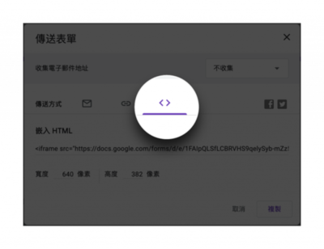
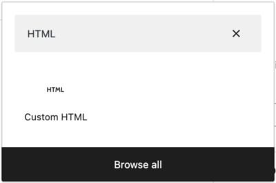
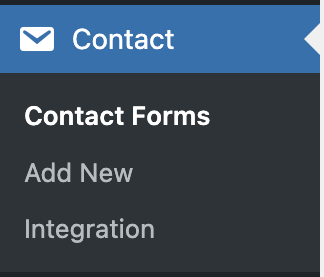
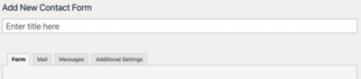
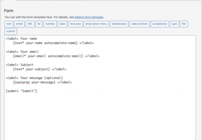
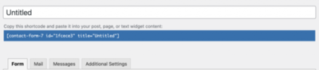

不論是公司的官方網站或是個人的網站，我們都會很常透過建立一個「連絡表單」來讓網站讀者留下資訊。這些資訊可能是單純的留個言、問個問題，或是合作聯繫，這些都是很常見的用途。所以我們這個單元會來帶大家來製作網頁表單。

在 WordPress 上面使用網頁表單的方式，有好幾百種，你可以**選擇第三方的方式**插入 WordPress 頁面，或者是 WordPress 官方外掛目錄也有許多優秀的**網頁表單外掛**可以做選擇。

<!--more-->

## 第三方表單

使用第三方表單的好處是，有時候我們為了使用較完整的表單設計與回覆管理，所以也可能選用第三方表單服務，例如：SurveyCake 或 Google 表單。那該怎麼做呢？我們可以直接透過嵌入 HTML 的方式，直接在 WordPress 網頁上新增表單。

### Google 表單

我們這邊用 Google 表單作為範例，教大家如何取得 HTML 程式碼，並且嵌入 WordPress 的頁面或是文章。

一、假設我們建立好 Google 表單了。我們可以點選右上角的**傳送**。

二、打開後，我們使用**嵌入 HTML**，複製下面那段程式碼。

三、我們回到 WordPress 的區塊編輯器，區塊選用 **Custom HTML** (自定 HTML)。

四、**貼上**剛剛在 Google 表單複製的那段程式碼。

我們回到前台，就會直接顯示我們製作的表單了。

### SurveryCake

我們可以在發布問卷的時候，選用**嵌入碼**，複製程式碼。至於放到 WordPress 頁面上的方法和 Google 表單差不多，這裡就不多做贅述。

## 外掛

WordPress 上面提供了很多表單的外掛，各有特色。比較知名的有 **Contact Form 7** 就是相當的靈活且易於客製化、支持多種語言、提供多種類型的表單型態。 **WPForms** 的話，則是提供許多表單範本，方便我們去做使用，然後他可以整合到各種常見的信件行銷服務。 **Ninja Forms** 則是提供許多表單外掛，設計界面也很直覺、還有強大的反垃圾信功能。

每個外掛都有各自的優缺點，我不會說哪個好用，哪個不好用。我覺得只要符合自己的需求的，就是好外掛。 (當然了，還要考量一下價錢。)，那這篇會和大家分享 Contact form 7 這個表單外掛的使用 (因為我自己最常用這套。)

### 安裝 Contact form 7

這個外掛在熱門排行長年位居第一，因為他使用上相對輕量的，功能也相對簡單好上手，所以很多人推薦。

一、我們可以透過 **Add New** 來開啟我們的第一個 Contact form 7 表單。

二、進入表單後，我們先把目光放上面。上面可以填寫這個表單的標題。

接著，我們看到有四個選項，分別是：

**Form**: 我們可以在這設計和建立我們的網頁表單。我們可以添加各種不同的欄位類別，例如：文字、選擇框、單選框等。  
**Mail**: 讓我們在這進行表單的信件通知設定。當有人提交表單時，會送出信件通知，我們可以在這設定，要寄給誰？寄什麼內容？  
**Messages**: 我們可以在這裡定義表單的各種訊息，例如成功訊息、錯誤訊息等。  
**Additional Settings**: 可以在這加入自定義的 JavaScript 和 CSS 程式碼，進一步客製化表單的功能和外觀。

三、設計我們的表單。我們可以在這輸入我們的表單內容，上面也有提供一些 Form-tag 供我們使用。電話、日期、數字，可能會用到的欄位類型，這邊都有。

四、當我們設定好後，就可以按 **save** 儲存了。

五、這時候，Contact form 7 會跳出一段 shortcode 。我們需要**複製 short code** ，等等來使用。

💡 \*\* Shortcode\*\* 在 WordPress 是一種很常見的用法。你可以理解成他是一段簡短的程式碼，允許你快速和簡便地嵌入檔案、建立物件或插入特定的功能和內容到你的文章或頁面中。

六、這時候我們可以到網站的文章、頁面中，也就是你想要讓表單出現的地方，使用 **Shortcode** 這個 block。

七、把剛剛複製的 Shortcode **貼上**。

我們回到前台，就會直接顯示我們製作的表單了。

這幾種製作網頁表單，都是很常見的方法，各有優缺點。這個單元，我們介紹了直接用第三方嵌入 HTML 的方法，也介紹了如何用外掛加入的方法。無論是哪種方法，能夠符合你的需求的就是好方法！另外，我們也學了 WordPress 世界中常用的 shortcode 功能，之後很多地方都會用到 shortcode ，所以這個部分也很重要喔！
