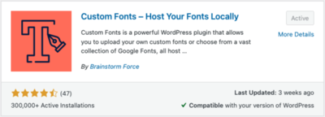
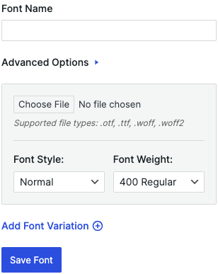
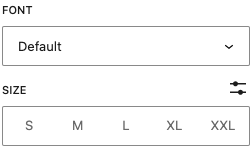

一般來說，使用者看的網頁中的字型，會因為作業系統或是瀏覽器預設而不同。假設說說你用 Windows 那可能就是預設微軟正黑體或者是你用 MacOS 那可能預設就是 Apple 蘋方體。

所以我們可能會在網站的設計上，選擇使用了某些字型，但是使用者在瀏覽這個網頁的時候，看不到效果，因為他們的電腦不一定有安裝這套字型，就會使用預設字體，整體網站的呈現就會不如我們的預期。所以在這個單元會來分享，要怎麼在網頁上導入字型。讓使用者可以看到我們精美的設計。

<!--more-->

## Webfont

在開始之前，我們可以去深入的觀察佈景主題的話，我們可能會發現有些佈景主題，可以在編輯器裡，看到有許多字型選項。問題來了！很多字型按了之後沒有反應，這是為什麼呢？因為大多數的 WordPress 佈景主題預設給的都是英文字型，所以我們把他套用在中文上，他不支援中文，就會無效。

因此我們在剛開始架站的時候，容易碰到明明套了版型，卻整個網頁都長歪掉，很大原因就是出在字型不支援中文的緣故，所以我們需要裝一些支援中文的字體。

但是又回到最一開始說的，如果使用者電腦沒有這個字體，那他就會顯示預設的字體。所以這個時候，我們會需要利用 **Webfont** 來達成這個目的。這是一個基於網路雲端的字型嵌入技術，可以讓使用者瀏覽網頁的時候，直接將網頁中的文字置換成我們指定的字型。

## 安裝字型

我們這邊以 Google Fonts 作為範例。那除了 Google Fonts 以外，相關的網頁字型服務都是類似這樣的做法，比如說 Adobe Fonts 或 justfont，我們也都可以在這裡找到一些我們想要的中文的網頁字型，然後透過這樣的方法來安裝。

👉 [Google Fonts 連結](https://fonts.google.com/)

在這之前，我們需要安裝 **Custom Fonts** 這個外掛。

一、安裝完外掛後，我們回到 Google Fonts 。進入後我們可以在字型列表中，找幾個我們想要使用在網頁上的字型。

二、接著我們滑到下面，我們可以像是購物車的方式，將想要的字體 **select** 起來。

三、當我們選完之後，打開右上角的\*\*「包包」\*\*。

四、點選 **Download All** ，下載後解壓縮。

五、我們回到剛剛安裝的 Custom Fonts 外掛。

六、我們點選 **Add New Font** 來新增字體。

六、給字體一個命名，然後上傳剛剛解壓縮後的檔案後，按下 **Save Font**。

七、按 **Save** 儲存。儲存之後，我們就成功導入想要的字體了。

## 使用字型。

字型導入後，可以使用的地方很多，無論是之前說的 header 和 footer ，又或者是在你的文章或頁面，都可以去做使用。那我們這邊先來看一下，如何在文章或頁面內做使用。

接著，我們再回到頁面或是文章，我們在編輯 Block 的屬性時候，可以點選 **Typography** 旁邊的點點，會看到 **Font Family** ，把他勾起來。此時，下面會多了一個 Font 可以做選擇。

我們就可以去選擇剛剛導入的字體，來做更換。如此一來，我們就有美美的網站了！

順帶一提，一個網站可以套用多個網頁字型，不過不建議這樣做，中文字型的大小其實都滿大的，所以過多的字型可能會讓你的網站質感提升，但同時也會去影響到我們網頁的瀏覽速度，這中間要怎麼取捨？我們可以好好思考。

以上就是這個單元對於網頁字型的介紹與中文字型的使用方法。
