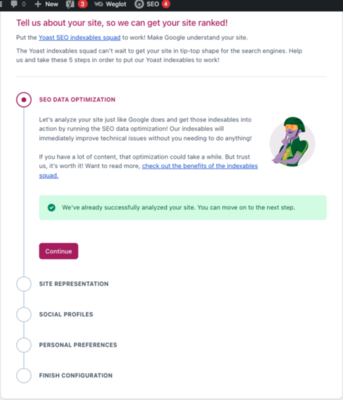
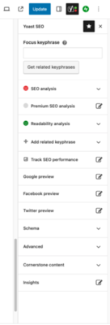

這個單元來談談要怎麼在 WordPress 網站上做到 SEO 的最佳化。SEO 是 搜尋引擎最佳化 的縮寫，來提高在搜索引擎中排名和曝光度的策略和技巧。其目標是透過改進網站內容、結構等因素，使其在搜索引擎結果頁面上獲得更高的排名，以增加自然流量。

<!--more-->

那我們最初選擇用 WordPress 來架站，就已經有先天上的優勢。因為 WordPress 體系在全球的網站上佔比相當龐大，而且因為是部落格架構起家，程式碼本身就對搜尋引擎天生的友善。

## SEO 檢查

接下來我們來看看幾個提升 WordPress 在 SEO 上的重要檢查。

一、文章連結的永久連結的部分，要設定為直接用文章名稱或是用純數值。這個做法是讓文章網址保持簡短。所以除了這兩個之外，其他的設置方式我都不建議，像是加了月份日期或是疊了很多層的網址，都對 SEO 不友善。

二、網站的網域要是用自己購買的，有些主機商會給一些臨時網域，有人會拿來做使用，這也是不推薦的。

三、前面單元提到的 SSL 安全性憑證的設置，一定要做，要讓你的網站是 https ，而不是 http。

## 用心產文章

SEO 還有一個很重要的一點，就是網站上要有足夠且高品質的文章。如果被搜索引擎判定為好的內容，網站總流量就會越來越多，閱讀觀看的停留時間夠長，也就越容易被判定成是好的網站，這是一個善的循環，一來一往在 SEO 上就肯定會加分很多。

所以要把網站的搜尋引擎排名提升，長期撰寫品質好的文章內容是一定要做的事情，那什麼是好的文章基本功呢？這邊簡單歸納出幾個重點：

1. 標題的關鍵字要夠精準

3. 內文標題段落要清楚

5. 文章內容圖文並茂

7. 文章不可以重複甚至抄襲

## Yoast SEO

前面講了這麼多，最後是來裝一下 WordPress 的 SEO 最佳化外掛 **Yoast SEO** ，同樣的相同功能的外掛，也是有很多款，挑一款適合你自己的就是好外掛。但因為我慣用 Yoast SEO ，所以我們今天就來介紹 Yoast SEO ， Yoast SEO 在全球已經有五百萬以上網站安裝，並且介面有支援中文，在設定上也相當簡單。

一、安裝並啟用。

二、直接點 **Start first-time configuration!** 來進入設定引導。

三、我們就跟著他的欄位依序設定，他要什麼，我們就填什麼即可。

設定完成後，我們可以回到文章頁面，我們可以看到右邊多了一個 Yoast SEO 的區塊。我們可以在設關鍵字、標題、代稱、分享到社群的縮圖。甚至我們可以在這看到 SEO 的分析和建議，這也可以作為我們文章的品質好壞的一個依據。

在基本設置都完成，好的文章也都有紮實的寫著，那我們接著能做的就是放著等發酵，隨著時間的過去，網站就愈容易被搜尋引擎所看見。以上就是 SEO 最佳化外掛 Yoast SEO 的介紹，當然了 SEO 是一門很高深的學問，我這邊只是引入門而已，所以講得很簡單，詳細的話，大家可以去找看看一些 SEO 的課程或是文章來參考。
