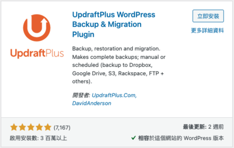
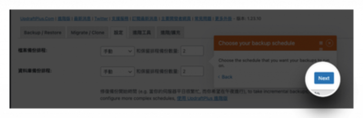
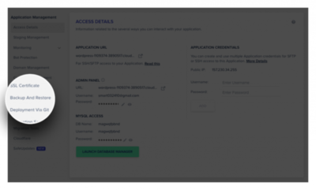
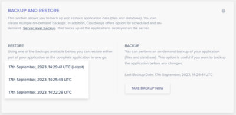

  
這個單元我們來聊聊網站的備份與還原方式。我們現在這個網站可能剛架好，還不會遇到，但是在不久的將來，我們很有可能可能會因為裝了某個會跟網站衝突的外掛，或是誤觸了某項功能或是設定，導致網站整個壞掉了，或是一個不小心，頁面或是文章遺失了，這時候如果我們有備份的話，我們會感謝當時有設定備份的自己。

<!--more-->

其實在 WordPress 的外掛目錄搜尋「備份」，會有滿多的外掛。但是很不幸的，常常我們會用到備份和還原，都是剛剛好連網站後台都進不來。這時候網站內部的外掛，可能幫不上什麼忙！！

所以會推薦的作法是**外掛**搭配**主機內建**的備份服務，最為保險安全。所以，今天這兩個辦法，我們都會來學習。

## 使用外掛備份

備份的外掛也是有百百種，所以這邊也是會跟你說，選一個你用得上手的就好。那我這邊會是推薦 **UpdraftPlus** ，因為我自己是用的很習慣，也覺得很方便。所以這邊就介紹這款備份外掛。

### 備份

一、安裝並啟用他。

二、安裝完成後，他會提示我們，我們點選 **Press here to start!** ，開始備份設定。

三、他會提示我們開始第一次備份，我們按下 **Next** ，來開始。

四、接著會問我們備份的頻率和數量。分為檔案的備份，也就是圖片、影片那些。還有資料庫的備份，也就是文章、頁面、網站設定，那些會被存放在資料庫的資料。預設是兩天備份一次，只有保留兩份備份。頻率和保留數量因人而異，如果你可以接受網站壞掉後，資料回到七天前，那你就設定七天。如果你兩天就沒辦法接受，那你就設定一天，前提是，你的儲存空間要夠大就好。如果都沒問題的話，我們就按 **Next** 來儲存設定。

五、備份儲存位置。我會建議一開始存在 Google Drive 即可。所以我們選擇 **Google Drive** 來做為我們的儲存空間。選好後，按 **儲存變更** ，此時會跳出一個 Google 授權認證的畫面，我們直接點 Sign in with Google ，並且允許權限。

六、我們會看到一個橘色畫面，並且按下 **Complete setup** 。

七、我們會看到上面跳出這個成功訊息，那就是設定完成了。

### 還原

我們可以直接進入 UpdraftPlus 的設定頁面，在 Existing backups 的區塊可以看到之前的備份。我們可以直接點擊下載，也可以點選 **還原** ，來還原到某個備份時間。

一、我們選擇好想要還原的時間點後，可以點選要還原的部分，好了話就按 **Next** 進入下一步。

二、此時，UpdraftPlus 就會去抓取我們備份到 Google Drive 的檔案，抓下後，就可以按下**還原**，回到我們想要還原的時間點。

## 使用主機備份

因為我們是使用 Cloudways 的主機。所以，在我們剛裝好 WordPress 網站的時候，Cloudways 就已經自動幫我們開啟了備份的功能！

### 備份

一、我們在登入後，進入 **Servers** 。

二、裡面找到自己 WordPress 正在使用的 Server ，開啟後打開 **Backups** 。

我們可以在這調整備份的頻率或是哪個時間點進行備份，也可以在這設定。

**Schedule Time** 是備份時間，我們會建議可以找比較冷門的時間點來備份。  
**Backup Frequency** 是備份頻率，看你要多久備份一次。  
**Backup Retention** 是備份保留時間，看你每個備份要保留多久。

設定完成後，記得選擇 **SAVE CHANGES** 。

💡 要注意的這邊是 UTC 時區，也就是台灣時間是 +8 喔。

### 還原

一、還原的話，則是要去 **Applications** 。

二、打開我們的 WordPress 應用，進入 **Backup And Restore** 。

三、我們可以在這邊選擇要還原的日期，這裡會列出近期有備份的時間點。

四、選好後，直接點選 **RESTORE APPLICATION NOW** ，來還原到我們選擇的時間點。

另外，如果你想在網站裝一個陌生的外掛，或是你可能有一些大膽的想法要在網站上做實驗，都會建議都要來這邊立即備份，至少網站出事了還可以還原回去。那如果要立即備份的話，直接點選 **TAKE BACKUP NOW** 即可。

最後，還是要祝福大家，網站都乖乖不掛掉，永遠不會碰到備份還原的功能！
