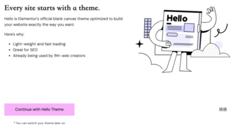
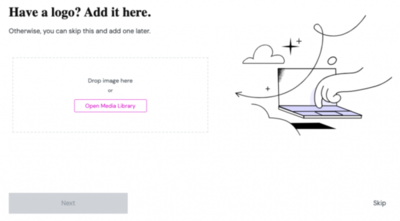
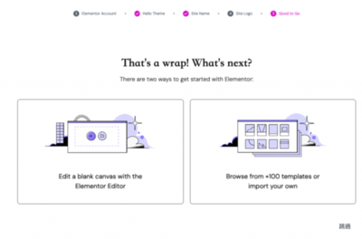
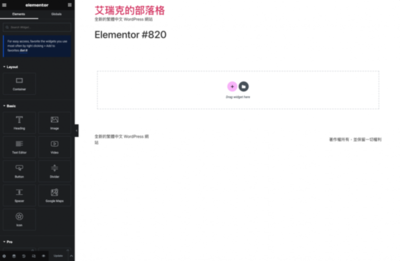
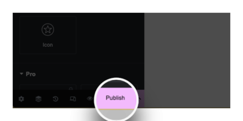
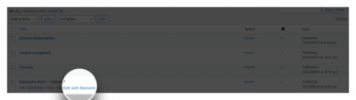

一個美美的網站是吸引網站讀者多看幾眼很重要的因素。説到網頁設計，大家第一個應該是會叫你去學 HTML 和 CSS ，學完之後，再來學個 JavaScript 。聽到這些，可能就會讓我們卻步。不過，不用擔心，今天我們要來聊聊頁面編輯器。同樣的，頁面編輯器的外掛也是百百種，而 **Elementor** 就是一個很優秀的 WordPress 頁面編輯器，他可以讓我們以直觀且無需程式知識背景的方式建立出美麗、具設計感的網站。

Elementor 採用所見即所得（WYSIWYG）編輯器，也就是讓我們能夠在瀏覽器上面即時看到我們的變更。我們只需透過拖放元素的方式來調整設計，很快地就可以建立完美的網頁。而 Elementor 也提供了大量的預設元素和範本，包括文字、圖片、按鈕、影片、表格等，讓我們在製作頁面的過程可以省下不少時間。同時，我們也可以自由的去自訂每個元素的樣式、排列和動畫，以滿足我們的特殊需求。

## 如何開始 Elementor

一、前往 WordPress 外掛目錄，搜尋 **Elementor** ，安裝後啟用。

二、此時會進入 Elementor 的安裝引導畫面。他會問我們要不要建立一個 Elementor 帳號，會提供很多專業範本可以使用，以及透過 Dashboard 來管理我們的網站，另外還可以參與社群論壇進行交流。那這裡就是看你要建立或是跳過都可以。

三、確認是否要使用 Elementor 提供的佈景主題 **Hello**。這套主題使用起來很輕量、且對 SEO 很友善，最重要的是和 Elementor 相容性極佳！所以這邊建議使用。

四、設定網站名稱，輸入我們的網站名稱，好了話就按 **Next** (下一張)。

五、設定網站 Logo，上傳我們的網站 Logo 圖片，好了話就按 **Next** (下一張)。

六、我們可以在這頁選擇從一個空白的頁面開始，或是選擇一個範本開始。兩個選項都可以，如果你已經很有想法了，那就從空白頁面開始吧！如果你完全沒有想法，那我會建議從一個範本開始，或許可以給你些靈感。

七、無論我們選兩個都會打開所見即所得（WYSIWYG）編輯器，我們只需要在上面透過拖拉的方式，就可以很輕鬆的完成自己設計的頁面，我們也可以自訂這些元素的外觀和排列。

八、設計都沒問題完成後，我們可以點擊 **Publish**。

## 編輯頁面

我們之後如果要回去編輯頁面的話，也可以進入頁面列表，然後點選 **Edit with Elementor** 來去編輯舊有的頁面。

Elementor 是一個出色的 WordPress 頁面編輯工具，它讓我們在設計和建立網站上，變得簡單且有趣。無論我們是一位新手還是一位專業人士，Elementor 都可以幫助我們實現我們的網站設計夢想。所以，很推薦不想學習程式的大家使用。
