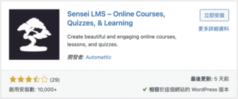
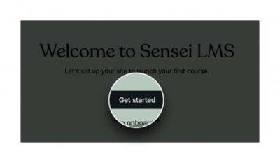
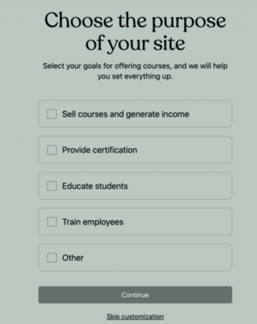
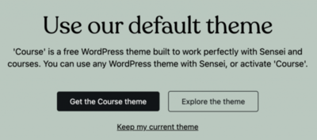
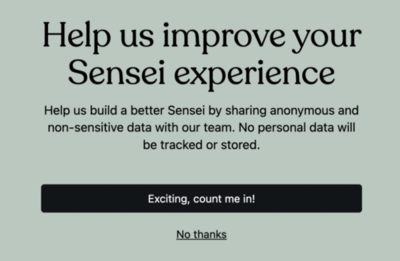
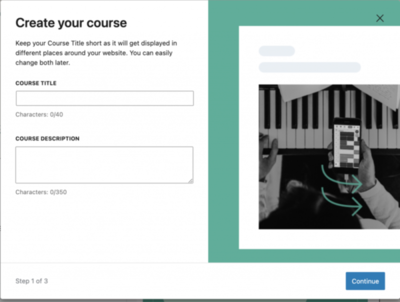
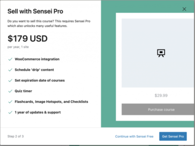
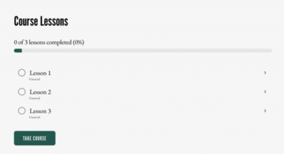
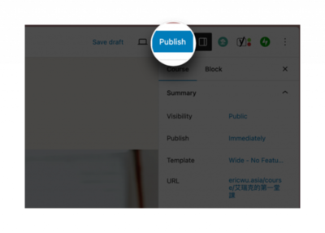
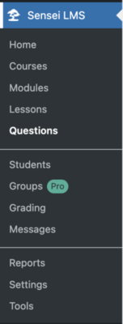

近幾年，線上課程如同雨後春筍般，一堂又一堂的開，線上課程平台也是一家又一家的開。大家應該都有個想法就是，擁有自己的課程，然後可以販售這些知識。所以，市面上很多開課工具，也是一個又一個出來。 WordPress 也是有很多學習管理系統的外掛。其中 **Sensei LMS** 這一款由 WooCommerce 團隊開發的 WordPress 外掛，就是專為建立和管理線上課程設計的。

<!--more-->

那筆者我本身是在線上教育平台任職，所以對於一個線上教育平台需要哪些功能還算是有點概念。我之所以會推 Sensei LMS ，正因為他是一個很符合線上教育平台的外掛，該有的功能都有，從開課、售課、到進行測驗，甚至是取得學員的學習狀況，這些基本功能都做得很好，所以我今天會來推薦使用 Sensei LMS 。

## 安裝與使用

一、我們需要在 WordPress 網站上安裝和啟動 Sensei LMS 外掛。一樣的，我們可以直接在 WordPress 外掛目錄找到它，安裝並且啟動。

二、安裝完成後，我們會進入使用引導的畫面，我們直接點選 **Get started** 來開始設定。

三、選擇我們使用這個外掛主要的用途，因人而異，看你的使用情況去選擇。選好後，點 **Continue** 來進行下一步。

四、預設主題。他會給我們一套預設主題，要不要使用也是取決於我們，用的話會對於外掛的相容性比較好。

五、確認要不要給予使用上的回饋，讓 Sensei LMS 更好。

六、要不要訂閱 Sensei LMS 的更新通知。

七、都確認完成後，就會開始 Sensei LMS 的初始化。

## 建立課程

一、我們看到設定完成的畫面後，直接點選 \*\*Create your first course \*\* ，來建立我們的第一堂課程。

二、設置課程名稱和介紹。我們可以輸入這堂課程的名稱和簡短的介紹，沒問題後，就點 **Continue** 來進行下一步。

三、這邊會問你要不要升級到 pro 版本，升級後會有很多好處。如果沒有要的話我們就先點 **Continue with Sensei Free** 跳過

四、選擇我們的課程介紹頁想要長怎樣。Sensei LMS 提供我們很多排版讓我們做選擇，所以可以很輕鬆的擁有一個有設計感的課程介紹頁。

完成後，這個時候你會發現，這不是原本 WordPress 發文章的區塊編輯器嗎？是的！WordPress 就是這麼讚！直接在你原本熟悉的界面上去操作就好了。

比較特別的是，下面會多了一種特殊類型的元素。這個元素是用來製作課程單元的，可能要留意一下喔！

五、一切都完成後，我們一樣按下 Publish 來發布我們的一堂課程。

這樣我們就會建立我們的第一堂課程了。

## 其他功能

Sensei LMS 也提供了很多其他的功能，可以讓我們去做使用。

我們可以你為我們的課程建立測驗，來評估學生的學習進度。這個測驗提功能各種題型，像是說單選題、多選題，甚至是開放性問題都有。我們也可以通過 Sensei LMS，去輕鬆地管理我們的學生和他們的學習進度。我們可以直接查看學生的進度報告，並在需要時提供回饋和指導。

另外，如果我們有計劃出售課程的話，Sensei LMS 可以和 WooCommerce 很完美的整合。所以我們可以直接通過 WooCommerce，來可以設置課程價格，並管理訂單和付款。不過這個部分會需要付費，但是我覺得如果你有要認真經營這塊的話，每個月 19 美金 (一年更便宜)，我覺得這是可以投資的。

我們現在可以撰寫文章、也可以架設電子商務網站、還可以在 WordPress 上面建立線上學習平台。這就回到我最一開始說的，為什麼選擇 WordPress ？是的，WordPress 真的很強大，我們可以在上面完成我們的夢想。

那你會問？我們做了這麼多事情，錢也花下去了，我該怎麼賺到錢？接著，我會來和大家分享，我自己如何在我的 WordPress 上面賺到錢。
