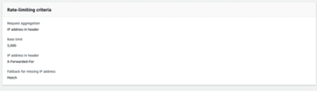

目前在前後端分離開發架構下，常會遇到的問題。也就是當我們的前後端架構中存在，像是 CDN / 代理 proxy / 負載平衡器等中介服務，因為都是特定幾個 IP 來代表訪問後端，所以在前端去呼叫後端 WAF 的時候，就有很高機率會將這些 IP 誤認為攻擊來源，而被封鎖。

<!--more-->

而目前業界較常見的解法，就是多加利用 X-Forwarded-For（XFF）這個 http header，用這個 header 來記載 Client 端 ( Viewer ) 的實際 IP，而後端 WAF 也根據這個值來進行 rate restrict 判斷，就比較不會失真。

而這個 X-Forwarded-For header 算是大家約定成俗的 header了，相當主流，因此除了AWS的服務中有採用，就算我們的前後端包含其他廠家服務 / 設備，通常也都是用 X-Forwarded-For header 的機制，因此也不會有銜接的問題。

**那我們要怎麼在 CloudFront + AWS WAF 調整設置呢？**

首先我們的 CloudFront 不需配置，CloudFront 在跟我們的後端 ( origin ) 建立 http 連線時，會自動將 Viewer IP 加入到 X-Forwarded-For header 再送

後端 WAF： 以 AWS WAF 為例，我們要建立一條 **Rate-based rule** ，系統會問我們要依據 Source IP address 或是 IP address in header 。如果選後者，AWS WAF 就會預設根據 X-Forwarded-For 這個 header 值進行 rate 統計。

而這個方法，有個限制就是 X-Forwarded-For 因為是 http header，算是 Layer 7 資訊，如果我們的後端偵測設備是 layer3 - 4 的元件 ( 例如傳統防火牆 ) ，就有可能就看不懂這個 X-Forwarded-For 這個 header。

不過，因為我們是採用 WAF 來偵測，因為 WAF 算是 layer 7 防火牆，所以應該就不太會有這個無法解析 X-Forwarded-For header 的疑慮。
