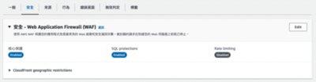
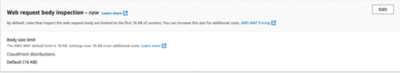
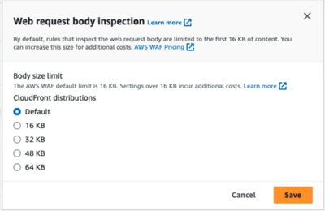

公司的網站一直一來都是採用前後端架構，前後端都使用 CloudFlare 作為 CDN ，近期 CloudFlare 一直常常出問題，所以決定搬 CDN 去 AWS CloudFront。搬完家後，發現呼叫同一隻 API (儲存購物車)，有時可以成功，有時候又失敗。

<!--more-->

我試著打開開發人員工具看看，呼叫後的錯誤訊息。Network 會出現 **has been blocked by CORS policy: No 'Access-Control-Allow-Origin' header is present on the requested resource.** 的問題。

[](https://ericwu.asia/wp-content/uploads/2024/02/截圖-2024-02-13-15.47.09.png)

我原本以為是 CORS 的問題，所以試著在在cache policy 加入 origin 「forward the headers using a cache policy」。確保從 client 送出的連線，如果 Origin 不同，彼此絕對不共用快取結果，依舊沒有解決這個問題。後來，去 CloudWatch 看到錯誤的原因，出現這樣的錯誤：

```
RID:UuU1L_7mWcIdyXZj66Tgc98oa68YwKTM_koBSNGs17JPUG6FZRbPcw== / Feb 07 18:04:48 UTC+8 2024
```

  
研究了一下，是因為連線經過 CloudFront 後，緊接著到了 WAF 檢查，而這筆連線符合 WAF 的 block rule，因此受到阻擋。 我透過 CloudWatch 的指標跟時間點進行交叉比對，看起來是 WAF 規則的 **SizeRestrictions** 所觸發。

才知道原來是我開了 WAF ，而 **WAF 的 http body 預設規則大小是 16 KB**。也就是因為這樣，如果在呼叫購物車這隻 API ，使用者如果放太多東西的話，那就會出現錯誤。

[](https://ericwu.asia/wp-content/uploads/2024/02/截圖-2024-02-13-15.52.34.png)

既然預設規則太小，就去調整 Body size limit 吧

[](https://ericwu.asia/wp-content/uploads/2024/02/截圖-2024-02-13-15.54.20.png)

結果他能調整最高的上限是 64 KB ，這就很傷腦筋，因為有的時候，還是會有要上傳圖片之類的需求。

[](https://ericwu.asia/wp-content/uploads/2024/02/截圖-2024-02-13-15.55.59.png)

既然，不能用的話，我們就自己設定規則，我們到 **Rules** 標籤，點選 **Add rules** ，點選 **Add my own rules and rule groups** 。

[](https://ericwu.asia/wp-content/uploads/2024/02/截圖-2024-02-13-16.00.12.png)

**Name** 隨便填寫即可，**Type** 要選擇 **Regular rule** 。

[](https://ericwu.asia/wp-content/uploads/2024/02/截圖-2024-02-13-16.01.42.png)

**If a request** 要選擇 **matches the statement** ，**Inspect** 要選擇 **body** 。

[](https://ericwu.asia/wp-content/uploads/2024/02/截圖-2024-02-13-16.02.40.png)

  
**Match type** 選擇 **Size greater than or equal to** 。**Size in bytes** 選擇你想要限制的最大上限。

**Oversize handling** 選項，有 3 種值可選，分別為 Continue / Match / No Match，必須要選**Continue**。

[](https://ericwu.asia/wp-content/uploads/2024/02/截圖-2024-02-13-16.07.34.png)

Save 儲存後，記得將優先權調高。

[](https://ericwu.asia/wp-content/uploads/2024/02/截圖-2024-02-13-16.12.00.png)

接著回到 Rules ， 找到 **AWS-AWSManagedRulesCommonRuleSet** ，點進去後，點到 **SizeRestrictions\_BODY**，編輯他的值(透過下拉選單選擇)必須為 **override to allow** 或是 **override to count**。

[](https://ericwu.asia/wp-content/uploads/2024/02/截圖-2024-02-13-16.16.10.png)

因為 rule-SizeRestrictions\_BODY 是造成我們連線 403 的 WAF 預設規則，每當我們 WAF 檢查到這條 rule 時，就會被 block 了。因此我們的做法就是略過這條 body size 的規則，取而代之用我們自己定義的 body size 檢查 rule 就好。如此一來就可解決被 WAF block 的情況！
