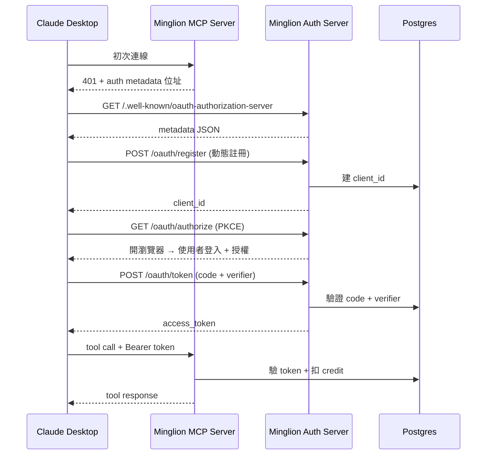

想讓使用者不用手動貼 API token、不用改 Claude Desktop 的 config 檔，就能接上自家的 MCP server？答案是 OAuth。這篇把我在 Minglion 實作 OAuth 2.1 的完整路徑走一遍，含 5 個踩過的坑。

<!--more-->

只是 MCP 的 OAuth 跟我們熟悉的網站 OAuth 不太一樣，這次去註冊 OAuth client 的不是開發者，而是 Claude Desktop 本身。所以規格多加了一個 **Dynamic Client Registration**，讓 Claude Desktop 第一次連線時自己跟 server 註冊、自己跑 PKCE，使用者全程只要按一次「允許」。

## 為什麼 MCP 的 OAuth 跟我們熟悉的不一樣

傳統 OAuth 長這樣：
- Developer A 想讓自家 app 接 Google Drive
- 去 Google Cloud Console 手動註冊 OAuth client，拿到 `client_id` / `client_secret`
- 把這兩個值 hard-code（或環境變數）進 app
- 使用者點授權，flow 跑完，token 存起來

這個模型對 **model** 行不通。我們不可能叫 Claude 先去每個 MCP server 手動註冊，然後把 credentials 寫進 config。Model 面對的是「剛看到 URL 就要能用」的場景。

MCP OAuth 的解法是把**三個 RFC 堆起來**：

| 規格 | 用途 |
|------|------|
| **RFC 8414** - Authorization Server Metadata | Server 在 `.well-known` 公告自己怎麼運作 |
| **RFC 7591** - Dynamic Client Registration | Client 動態註冊、拿到一次性 `client_id` |
| **RFC 7636** - PKCE | 沒 secret 情境下保護 auth code |

串起來：**Model 抓 metadata → 自動註冊 → 跑 PKCE → 拿 token → 使用**。

---

## Minglion 的場景

Minglion（[minglion.com](https://minglion.com)）是我做的一個公開 API，把東西方占卜傳統（Tarot、I Ching、BaZi、紫微、西洋占星、姓名學）轉成 LLM-ready JSON，讓 Claude Desktop 這類 MCP client 可以直接在對話裡呼叫。

在加上 OAuth 之前，使用者要接 Minglion 的流程長這樣：

1. 登入 minglion.com，到 dashboard 生一組 API token
2. 複製那串 token
3. 打開 Claude Desktop 的設定檔（`claude_desktop_config.json`），找到 MCP server 區塊
4. 把 token 貼進 `env` 裡面
5. 存檔、重啟 Claude Desktop

五步驟裡有四步在 Claude Desktop 外面，而且一般使用者根本不會想碰 config 檔。光是「設定檔在哪」就能擋掉一半的人。

目標很簡單：把這條流程壓成「在 Claude Desktop 點一下『允許』」。其他的（拿 token、存 token、帶 Authorization header）全部協定層處理掉，使用者不需要知道。

這就是 OAuth 要解的事。

---

## 架構地圖



Minglion 實作上把 MCP server 和 Auth server 放在同一個 Next.js app，但邏輯上是兩個 role。

---

## Step 1 - OAuth metadata discovery

**Endpoint**: `/.well-known/oauth-authorization-server`

這是 Claude Desktop 第一個敲的門。回一份 JSON 告訴它「我們支援什麼、端點在哪」。

```ts
// app/.well-known/oauth-authorization-server/route.ts
import { NextResponse } from "next/server";

export async function GET() {
  const origin = process.env.APP_ORIGIN!; // e.g. https://minglion.com

  return NextResponse.json({
    issuer: origin,
    authorization_endpoint: `${origin}/oauth/authorize`,
    token_endpoint: `${origin}/oauth/token`,
    registration_endpoint: `${origin}/oauth/register`,
    scopes_supported: ["mcp:read", "mcp:invoke"],
    response_types_supported: ["code"],
    grant_types_supported: ["authorization_code", "refresh_token"],
    code_challenge_methods_supported: ["S256"],
    token_endpoint_auth_methods_supported: ["none"],
  });
}
```

關鍵欄位解釋：

- `registration_endpoint`：這欄告訴 client「我們支援動態註冊」，是 MCP 的 enabler
- `code_challenge_methods_supported: ["S256"]`：PKCE 必要
- `token_endpoint_auth_methods_supported: ["none"]`：public client，沒 secret

---

## Step 2 - Dynamic Client Registration

**Endpoint**: `/oauth/register`（POST）

Claude Desktop POST 自己的 metadata 過來，我們回一個 `client_id`。

```ts
// app/oauth/register/route.ts
import { NextRequest, NextResponse } from "next/server";
import crypto from "crypto";
import { db } from "@/lib/db";

interface RegistrationRequest {
  redirect_uris: string[];
  client_name?: string;
  token_endpoint_auth_method?: string;
}

export async function POST(req: NextRequest) {
  const body = (await req.json()) as RegistrationRequest;

  if (!body.redirect_uris || body.redirect_uris.length === 0) {
    return NextResponse.json(
      { error: "invalid_redirect_uri" },
      { status: 400 }
    );
  }

  const client_id = crypto.randomBytes(16).toString("hex");

  await db.query(
    `INSERT INTO oauth_clients (client_id, redirect_uris, client_name, created_at)
     VALUES ($1, $2, $3, NOW())`,
    [client_id, body.redirect_uris, body.client_name ?? "MCP Client"]
  );

  return NextResponse.json(
    {
      client_id,
      redirect_uris: body.redirect_uris,
      token_endpoint_auth_method: "none",
      grant_types: ["authorization_code", "refresh_token"],
      response_types: ["code"],
    },
    { status: 201 }
  );
}
```

**這裡值得多講**：傳統 OAuth 我們會存 `client_secret`，但 MCP 場景是 public client（跑在使用者機器上），不能放 secret。所以改用 PKCE 防範 auth code 被攔截後冒用。

Minglion 的做法：`client_id` 唯一、不過期、不關聯到使用者（此時還不知道使用者是誰）。綁 user 是 Step 4 的事。

---

## Step 3 - Authorization flow with PKCE

**Endpoint**: `/oauth/authorize`（GET，redirect 給人用的 browser endpoint）

Claude Desktop 把 PKCE challenge 一起帶過來，我們 redirect 使用者到 login + consent。

```ts
// app/oauth/authorize/route.ts
import { NextRequest, NextResponse } from "next/server";
import { db } from "@/lib/db";
import { getUserFromSession } from "@/lib/auth";

export async function GET(req: NextRequest) {
  const params = req.nextUrl.searchParams;

  const client_id = params.get("client_id");
  const redirect_uri = params.get("redirect_uri");
  const code_challenge = params.get("code_challenge");
  const code_challenge_method = params.get("code_challenge_method");
  const state = params.get("state");
  const scope = params.get("scope") ?? "mcp:read mcp:invoke";

  if (
    !client_id ||
    !redirect_uri ||
    !code_challenge ||
    code_challenge_method !== "S256"
  ) {
    return NextResponse.json({ error: "invalid_request" }, { status: 400 });
  }

  const client = await db.query(
    "SELECT redirect_uris FROM oauth_clients WHERE client_id = $1",
    [client_id]
  );
  if (!client.rows.length || !client.rows[0].redirect_uris.includes(redirect_uri)) {
    return NextResponse.json({ error: "unauthorized_client" }, { status: 400 });
  }

  // 使用者未登入 → 轉到登入頁，登完再回來
  const user = await getUserFromSession(req);
  if (!user) {
    const loginUrl = new URL("/login", req.nextUrl.origin);
    loginUrl.searchParams.set("next", req.nextUrl.pathname + req.nextUrl.search);
    return NextResponse.redirect(loginUrl);
  }

  // 產 authorization code（一次性、短期、綁 PKCE challenge + user）
  const code = crypto.randomBytes(24).toString("hex");
  await db.query(
    `INSERT INTO oauth_auth_codes
       (code, client_id, user_id, redirect_uri, code_challenge, scope, expires_at)
     VALUES ($1, $2, $3, $4, $5, $6, NOW() + INTERVAL '5 minutes')`,
    [code, client_id, user.id, redirect_uri, code_challenge, scope]
  );

  const redirect = new URL(redirect_uri);
  redirect.searchParams.set("code", code);
  if (state) redirect.searchParams.set("state", state);
  return NextResponse.redirect(redirect);
}
```

**PKCE 為什麼是保護**：就算壞人攔到 `code`，沒有原始的 `code_verifier` 也換不到 token。`code_challenge` 是 verifier 的 SHA256，server 只存 challenge、verify 時讓 client 證明自己知道 verifier。

---

## Step 4 - Token endpoint

**Endpoint**: `/oauth/token`（POST）

Client 拿 `code` + `code_verifier` 來換 access token。

```ts
// app/oauth/token/route.ts
import { NextRequest, NextResponse } from "next/server";
import crypto from "crypto";
import { SignJWT } from "jose";
import { db } from "@/lib/db";

const JWT_SECRET = new TextEncoder().encode(process.env.JWT_SECRET!);

export async function POST(req: NextRequest) {
  const form = await req.formData();
  const grant_type = form.get("grant_type");

  if (grant_type !== "authorization_code") {
    return NextResponse.json({ error: "unsupported_grant_type" }, { status: 400 });
  }

  const code = form.get("code") as string;
  const redirect_uri = form.get("redirect_uri") as string;
  const client_id = form.get("client_id") as string;
  const code_verifier = form.get("code_verifier") as string;

  const result = await db.query(
    `SELECT client_id, user_id, redirect_uri, code_challenge, scope, expires_at
     FROM oauth_auth_codes WHERE code = $1`,
    [code]
  );
  if (!result.rows.length) {
    return NextResponse.json({ error: "invalid_grant" }, { status: 400 });
  }

  const row = result.rows[0];

  // 驗 code 本身
  if (row.client_id !== client_id) return NextResponse.json({ error: "invalid_grant" }, { status: 400 });
  if (row.redirect_uri !== redirect_uri) return NextResponse.json({ error: "invalid_grant" }, { status: 400 });
  if (new Date(row.expires_at) < new Date()) return NextResponse.json({ error: "invalid_grant" }, { status: 400 });

  // 驗 PKCE
  const expectedChallenge = crypto
    .createHash("sha256")
    .update(code_verifier)
    .digest("base64url");
  if (expectedChallenge !== row.code_challenge) {
    return NextResponse.json({ error: "invalid_grant" }, { status: 400 });
  }

  // code 只能用一次
  await db.query("DELETE FROM oauth_auth_codes WHERE code = $1", [code]);

  // 發 access token（JWT）
  const access_token = await new SignJWT({
    sub: row.user_id,
    scope: row.scope,
    client_id: row.client_id,
  })
    .setProtectedHeader({ alg: "HS256" })
    .setIssuedAt()
    .setExpirationTime("1h")
    .sign(JWT_SECRET);

  // Refresh token（opaque，存 DB，長效）
  const refresh_token = crypto.randomBytes(32).toString("hex");
  await db.query(
    `INSERT INTO oauth_refresh_tokens (token, user_id, client_id, scope, expires_at)
     VALUES ($1, $2, $3, $4, NOW() + INTERVAL '30 days')`,
    [refresh_token, row.user_id, row.client_id, row.scope]
  );

  return NextResponse.json({
    access_token,
    token_type: "Bearer",
    expires_in: 3600,
    refresh_token,
    scope: row.scope,
  });
}
```

**Token 格式選擇**：
- **JWT**：stateless，不用查 DB，但吊銷困難（沒到期前只能靠 blocklist）
- **Opaque**：每次都要查 DB，但吊銷即時

Minglion 用 **混合**：access token 是短期 JWT（1 小時），refresh token 是 opaque 長期（30 天）。平衡 performance 與安全。

---

## Step 5 - 在 MCP tool call 驗證 token

MCP server 每個 tool call 都要驗 Authorization header。

```ts
// app/api/mcp/route.ts
import { NextRequest, NextResponse } from "next/server";
import { jwtVerify } from "jose";
import { db } from "@/lib/db";

const JWT_SECRET = new TextEncoder().encode(process.env.JWT_SECRET!);

async function authenticate(req: NextRequest) {
  const auth = req.headers.get("authorization");
  if (!auth?.startsWith("Bearer ")) return null;

  try {
    const { payload } = await jwtVerify(auth.slice(7), JWT_SECRET);
    return payload as { sub: string; scope: string; client_id: string };
  } catch {
    return null;
  }
}

async function deductCredit(userId: string, toolName: string): Promise<boolean> {
  const cost = TOOL_COSTS[toolName] ?? 1;
  const result = await db.query(
    `UPDATE users
     SET credits = credits - $1
     WHERE id = $2 AND credits >= $1
     RETURNING credits`,
    [cost, userId]
  );
  return result.rows.length > 0;
}

const TOOL_COSTS: Record<string, number> = {
  tarot_draw: 1,
  bazi_calculate_chart: 3,
  iching_cast: 1,
  // ...
};

export async function POST(req: NextRequest) {
  const identity = await authenticate(req);
  if (!identity) {
    return NextResponse.json(
      { error: "unauthorized" },
      {
        status: 401,
        headers: {
          "WWW-Authenticate":
            'Bearer realm="minglion", error="invalid_token"',
        },
      }
    );
  }

  const body = await req.json();
  const toolName = body.params?.name;

  if (!identity.scope.includes("mcp:invoke")) {
    return NextResponse.json({ error: "insufficient_scope" }, { status: 403 });
  }

  const ok = await deductCredit(identity.sub, toolName);
  if (!ok) {
    return NextResponse.json({ error: "insufficient_credits" }, { status: 402 });
  }

  // 實際 tool dispatch（省略）
  const response = await runTool(toolName, body.params.arguments);
  return NextResponse.json(response);
}
```

**重點**：token 驗證、scope 檢查、credit 扣款在同一個 handler。讓計費邏輯靠近 auth，避免 race condition。

---

## 5 個踩過的坑

### 1. Redirect URI 白名單 vs 動態註冊的衝突

Claude Desktop 本地會生一個 `http://127.0.0.1:{random_port}/callback` 當 redirect URI，每次可能不同。

解法：允許 `localhost` / `127.0.0.1` + 任意 port。Production 客戶真要用固定 URI 才加白名單。

### 2. Token lifetime 的 trade-off

一開始我設 access token 24 小時、沒 refresh。結果使用者改密碼、Revoke session 後，舊 token 還能用 24 小時。

改成 1 小時 access token + 30 天 refresh token。吊銷時把 refresh token 標記 revoked，下次 refresh 會被擋。

### 3. Claude Desktop token 快取行為

Claude Desktop 會 cache token 到下次需要時。如果 server 側旋轉 JWT secret，已發出去的 token 全部作廢，使用者會看到 MCP 連線突然死掉但沒錯誤訊息。

解法：**不要輕易換 JWT secret**。需要 rotation 時做 key id header + 多 key 併行期。

### 4. Scope 粒度設計

一開始只有一個 scope `minglion:all`。後來想做 read-only 分享（「讓 Claude 幫我看別人的盤但不能算新盤」），才發現 `mcp:read` / `mcp:invoke` 這種 split 一開始就設好比較好。

規則：scope 不夠細會重構，太細會沒人用。**至少做 read / write 分開**。

### 5. 本地開發 HTTPS 問題

Claude Desktop 不接受 `http://` redirect（除了 localhost）。本地 dev 時我用 `mkcert` 產自簽憑證 + `https://localhost:3000`，省事。

---

## 感想

MCP OAuth 的設計哲學可以一句話總結：**把 auth 從 developer setup 降到 protocol convention**。

過去 developer 是中間翻譯，告訴 model「這服務的 credentials 是這個、redirect 是那個、token 存哪」。MCP + Dynamic Client Registration 讓 model 直接跟服務對話，developer 只負責設對 endpoint。

這個 pattern 會擴散到其他協定嗎？我猜 billing 和 observability 是下一波。想像 Claude 自己去問「這個 MCP server 收費方式？」然後跟使用者確認，整個 payment flow 不需要額外的人工 setup。

這不是遙遠未來。Stripe 已經在試 AI agent checkout，Anthropic 也在實驗 Claude Payments。**OAuth 是第一個被協定化的 auth primitive，不會是最後一個**。

---

- 想看 MCP server 實際跑什麼樣子？[minglion.com](https://minglion.com) 是公開 MCP server，Claude Desktop 可以接來玩
- 想把 AI 接到自家系統、需要 MCP 整合？[歡迎聯絡](/about)

---

_此文以 Next.js App Router + TypeScript + Postgres 為例。其他 framework（FastAPI、Nuxt/Nitro、Express）協定層一樣，只是 handler 語法不同。_
