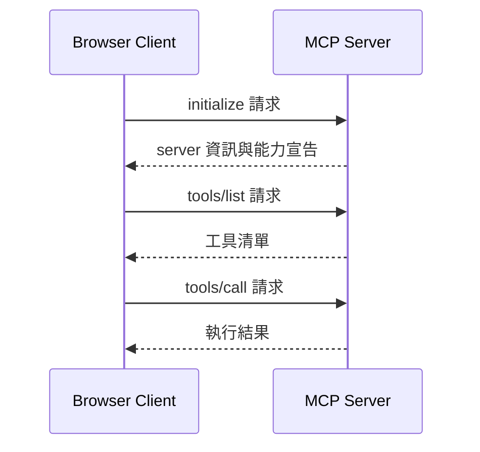

這篇將會用 Next.js + TypeScript 從零刻一個 MCP Web，你不需要接 LLM、或是使用任何 MCP SDK。重點會放在「協定本身長什麼樣」，看完打開 DevTools，你能讀懂任何 MCP client 在跟 server 講什麼，並且會有一個能連 HTTP MCP server、列工具、呼叫工具的網站。

<!--more-->


---

## MCP client 在做什麼

MCP 在 HTTP 上其實就是 **JSON-RPC 2.0**。Client 跟 server 三輪基本對話：



每一輪都是同樣格式的 POST：

```json
{
  "jsonrpc": "2.0",
  "id": 1,
  "method": "tools/list",
  "params": {}
}
```

Server 回對應的：

```json
{
  "jsonrpc": "2.0",
  "id": 1,
  "result": { "tools": [/* ... */] }
}
```

知道這個就夠開始寫 client 了。

---

## Step 1 - 起一個最簡 MCP server

我們先把 server 寫好，這樣 client 才有對象說話。Next.js App Router 一個 route handler 就夠：

```ts
// app/api/mcp/route.ts
import { NextRequest, NextResponse } from "next/server";

interface JsonRpcRequest {
  jsonrpc: "2.0";
  id: number | string;
  method: string;
  params?: any;
}

const TOOLS = [
  {
    name: "echo",
    description: "回傳傳入的字串",
    inputSchema: {
      type: "object",
      properties: { message: { type: "string" } },
      required: ["message"],
    },
  },
  {
    name: "add",
    description: "把兩個數字相加",
    inputSchema: {
      type: "object",
      properties: {
        a: { type: "number" },
        b: { type: "number" },
      },
      required: ["a", "b"],
    },
  },
];

function callTool(name: string, args: any) {
  if (name === "echo") {
    return { content: [{ type: "text", text: String(args.message) }] };
  }
  if (name === "add") {
    return { content: [{ type: "text", text: String(args.a + args.b) }] };
  }
  throw new Error(`Unknown tool: ${name}`);
}

export async function POST(req: NextRequest) {
  const body = (await req.json()) as JsonRpcRequest;

  try {
    let result: unknown;
    switch (body.method) {
      case "initialize":
        result = {
          protocolVersion: "2024-11-05",
          capabilities: { tools: {} },
          serverInfo: { name: "demo-mcp-server", version: "0.1.0" },
        };
        break;
      case "tools/list":
        result = { tools: TOOLS };
        break;
      case "tools/call":
        result = callTool(body.params.name, body.params.arguments);
        break;
      default:
        return NextResponse.json({
          jsonrpc: "2.0",
          id: body.id,
          error: { code: -32601, message: "Method not found" },
        });
    }

    return NextResponse.json({ jsonrpc: "2.0", id: body.id, result });
  } catch (err) {
    return NextResponse.json({
      jsonrpc: "2.0",
      id: body.id,
      error: { code: -32000, message: (err as Error).message },
    });
  }
}
```

幾個值得提的點：

- **三個 method 就夠**：`initialize`、`tools/list`、`tools/call`。MCP 規格還包含 resources、prompts、logging…，但 tools 是最常用、最先實作的能力。
- **`content` 陣列回傳結果**：MCP 要求 tool 回傳的是 `content` 陣列，每個 element 有 `type`（text / image / resource）。這篇只用 text。
- **JSON-RPC error code**：`-32601` 是 method not found、`-32000` 是 server error。沿用標準慣例方便 client 處理。

到這裡 server 就能跑了。對 `http://localhost:3000/api/mcp` POST 一份對應的 JSON 就有回應。

---

## Step 2 - 寫一個 MCP Client Class

把跟 server 通訊封裝成 class，React 元件用起來會乾淨很多：

```ts
// lib/mcp-client.ts
interface JsonRpcResponse<T> {
  jsonrpc: "2.0";
  id: number;
  result?: T;
  error?: { code: number; message: string };
}

export interface Tool {
  name: string;
  description: string;
  inputSchema: {
    type: "object";
    properties?: Record<string, { type: string; description?: string }>;
    required?: string[];
  };
}

export interface ServerInfo {
  protocolVersion: string;
  serverInfo: { name: string; version: string };
  capabilities: Record<string, unknown>;
}

export interface ToolResult {
  content: Array<{ type: string; text: string }>;
}

export class McpClient {
  private id = 0;

  constructor(private endpoint: string) {}

  private async call<T>(method: string, params?: unknown): Promise<T> {
    this.id += 1;
    const res = await fetch(this.endpoint, {
      method: "POST",
      headers: { "Content-Type": "application/json" },
      body: JSON.stringify({
        jsonrpc: "2.0",
        id: this.id,
        method,
        params,
      }),
    });

    const data = (await res.json()) as JsonRpcResponse<T>;
    if (data.error) {
      throw new Error(`${data.error.code}: ${data.error.message}`);
    }
    return data.result!;
  }

  initialize() {
    return this.call<ServerInfo>("initialize", {
      protocolVersion: "2024-11-05",
      clientInfo: { name: "browser-mcp-client", version: "0.1.0" },
      capabilities: {},
    });
  }

  listTools() {
    return this.call<{ tools: Tool[] }>("tools/list");
  }

  callTool(name: string, args: Record<string, unknown>) {
    return this.call<ToolResult>("tools/call", { name, arguments: args });
  }
}
```

設計小重點：

- **`id` 自己累加**：JSON-RPC 要求每個 request 帶唯一 id，server 回應會帶回對應 id。這篇用單向順序呼叫所以還沒用到，但留著是好習慣，之後做併發或 streaming 才不用回頭改。
- **`call()` 是 private helper**：把 envelope 統一處理，public method 只負責對應到 protocol method。
- **fetch 直接打相對路徑**：因為 server 跟 client 同源 (都在 Next.js 裡) ，不用煩惱 CORS。如果之後要打跨網域 server，server 那邊要回 `Access-Control-Allow-Origin`。

---

## Step 3 - 接到 React UI

最後一塊：一個頁面，按連線 → 看工具 → 點工具 → 填參數 → 看結果。

```tsx
// app/page.tsx
"use client";

import { useState } from "react";
import { McpClient, type Tool } from "@/lib/mcp-client";

export default function Home() {
  const [client, setClient] = useState<McpClient | null>(null);
  const [serverName, setServerName] = useState("");
  const [tools, setTools] = useState<Tool[]>([]);
  const [selectedTool, setSelectedTool] = useState<Tool | null>(null);
  const [args, setArgs] = useState<Record<string, string>>({});
  const [output, setOutput] = useState("");
  const [error, setError] = useState("");

  async function connect() {
    setError("");
    try {
      const c = new McpClient("/api/mcp");
      const info = await c.initialize();
      const list = await c.listTools();
      setClient(c);
      setServerName(info.serverInfo.name);
      setTools(list.tools);
    } catch (e) {
      setError((e as Error).message);
    }
  }

  async function invoke() {
    if (!client || !selectedTool) return;
    setError("");
    setOutput("");

    const parsed: Record<string, unknown> = {};
    for (const [k, v] of Object.entries(args)) {
      const type = selectedTool.inputSchema.properties?.[k]?.type;
      parsed[k] = type === "number" ? Number(v) : v;
    }

    try {
      const result = await client.callTool(selectedTool.name, parsed);
      setOutput(result.content.map((c) => c.text).join("\n"));
    } catch (e) {
      setError((e as Error).message);
    }
  }

  return (
    <main className="mx-auto max-w-2xl space-y-6 p-8">
      <h1 className="text-2xl font-bold">Browser MCP Client</h1>

      {!client ? (
        <button
          onClick={connect}
          className="rounded bg-black px-4 py-2 text-white"
        >
          連線到 MCP server
        </button>
      ) : (
        <>
          <p className="text-sm text-gray-600">已連線：{serverName}</p>

          <section>
            <h2 className="mb-2 font-semibold">可用工具</h2>
            <ul className="space-y-1">
              {tools.map((t) => (
                <li key={t.name}>
                  <button
                    onClick={() => {
                      setSelectedTool(t);
                      setArgs({});
                      setOutput("");
                    }}
                    className="text-left underline"
                  >
                    {t.name} — {t.description}
                  </button>
                </li>
              ))}
            </ul>
          </section>

          {selectedTool && (
            <section className="space-y-3 rounded border p-4">
              <h3 className="font-semibold">呼叫 {selectedTool.name}</h3>
              {Object.entries(selectedTool.inputSchema.properties ?? {}).map(
                ([key, schema]) => (
                  <label key={key} className="block">
                    <span className="block text-sm">
                      {key} ({schema.type})
                    </span>
                    <input
                      value={args[key] ?? ""}
                      onChange={(e) =>
                        setArgs({ ...args, [key]: e.target.value })
                      }
                      className="mt-1 w-full rounded border px-2 py-1"
                    />
                  </label>
                )
              )}
              <button
                onClick={invoke}
                className="rounded bg-blue-600 px-3 py-1 text-white"
              >
                執行
              </button>
              {output && (
                <pre className="rounded bg-gray-100 p-3 text-sm">{output}</pre>
              )}
            </section>
          )}
        </>
      )}

      {error && (
        <p className="rounded bg-red-100 p-3 text-sm text-red-700">{error}</p>
      )}
    </main>
  );
}
```

幾個值得提的：

- **`"use client"` 是必要的**：fetch、useState 都得在瀏覽器跑，這是 client component。
- **動態渲染 input schema**：拿到 tool 的 `inputSchema.properties`，根據 type 渲染對應 input。實務上你可能會接 `react-hook-form` + JSON Schema validator，這篇先用最樸素的版本。
- **錯誤統一收口**：`error` state 接住所有失敗 (連線、呼叫) ，免得 console 滿天紅、使用者一臉問號。

---

## 跑起來看看

`npm run dev`，打開 `http://localhost:3000`：

1. 點「連線到 MCP server」，下面出現 `已連線：demo-mcp-server` 跟兩個工具
2. 點 `add`，跳出 a / b 兩個欄位，輸入 `3` 跟 `5`，按執行 → 看到 `8`
3. 點 `echo`，輸入任何字串 → 原樣回傳

**強烈建議打開 DevTools 的 Network tab** 看 `/api/mcp` 的 request / response。MCP 從這個視角看就是「四個 POST、四個 JSON」，沒任何魔法：

| 步驟 | Request method | Response 重點 |
|------|---------------|---------------|
| 連線 | `initialize` | server name、protocol version |
| 連線 | `tools/list` | tools 陣列 |
| 呼叫 | `tools/call` | content 陣列 |

把這個視窗當書籤，之後讀 Anthropic 官方 SDK、別人寫的 MCP client，都是這四個 POST 的不同包裝而已。

---

## 接下來可以做什麼

這份 client 跑得起來，但離「真正能用」還有幾步：

- **接到 LLM 才有靈魂**：現在工具是使用者點按鈕呼叫的。把 `tools/list` 的結果餵給 Claude API、讓 model 自己決定要不要用、傳什麼參數，才是「MCP client」的本意。Anthropic SDK 的 `tool_use` block 直接對應這份協定。

- **連別人的 MCP server**：把 endpoint 換成遠端 URL（例如 `https://your-server.com/api/mcp`），server 端要設好 CORS。如果 server 需要驗證，就得走 OAuth flow — 細節我[上一篇](/blog/2026-04-22-給-mcp-server-加上-oauth-實作全紀錄/)寫過 server 端，client 端要做的是引導使用者跳 authorize、收 code、換 token、之後每個請求帶 `Authorization: Bearer`。

- **多 server 管理**：實際 MCP client 通常同時連好幾個 server（Claude Desktop 會列你 config 裡所有 server 的 tools）。把單例 client 改成 `Map<serverId, McpClient>`、`tools/list` 結果合併、`tools/call` 路由到對應 client，就有 production 雛形。

---

MCP server 端的實作模式已經很成熟，瀏覽器 client 則是另一個有意思的切面，預設大家都從 Claude Desktop 開始接觸，自己刻一遍才會發現協定其實就是 JSON-RPC 加幾個約定，比想像中簡單很多。

下一次有人問「我們網站怎麼接 MCP？」，希望這篇能省你 30 分鐘。

---

- 有 MCP / AI 整合的需求想聊？[歡迎聯絡](/about)
- 想看 MCP server 端的 OAuth 實作？讀我上一篇 [給 MCP Server 加上 OAuth](/blog/2026-04-22-給-mcp-server-加上-oauth-實作全紀錄/)
